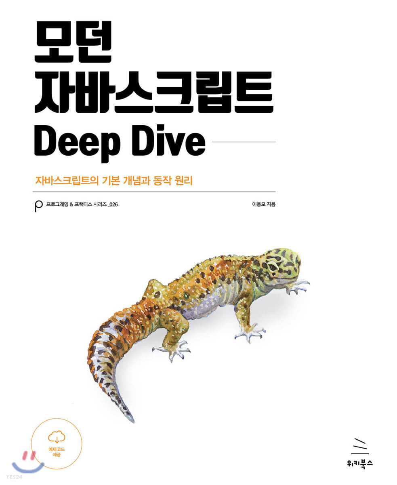

# 📚 모던 자바스크립트 Deep Dive

 

## 🐒 [모던자바스크립트](https://www.yes24.com/Product/Goods/92742567) 도서 내 코드로직들을 직접 실제 브라우저에서 학습하고, 기록하는 저장소

 
 

    

 
 

**[결국 자바스크립트를 알아보기로 했다](https://forward.nhn.com/2021/sessions/17)**

- 해당 영상에 영감을 받고 `"모던 자바스크립트 DeepDive"`를 기록하며 완독을 목표로 하고 있습니다

 

## 📝 목차

### 총 49장(916page)로 구성되어 있습니다.

- [1장 : 프로그래밍]
- [2장 : 자바스크립트란?]
- [3장 : 자바스크립트 개발 환경과 실행 방법]
- [4장 : 변수]
- [5장 : 표현식과 문]
- [6장 : 데이터타입]
- [7장 : 연산자]
- [8장 : 제어문]
- [9장 : 타입 변환과 단축평가]
- [10장 : 객체 리터럴]
- [11장 : 원시 값과 객체의 비교]
- [12장 : 함수]
- [13장 : 스코프]
- [14장 : 전역변수의 문제점]
- [15장 : let,const 키워드와 블록 레벨 스코프](./src/15_var.js)
- [16장 : 프로퍼티 어트리뷰트](./src/16_property_attr.js)
- [17장 : 생성자 함수에 의한 객체 생성](./src/17_constructor_function.js)
- [18장 : 함수와 일급 객체](./src/18_function_object.js)
- [19장 : 프로토타입](./src/19_prototype.js)
- [20장 : strict mode](./src/20_strict.js)
- [21장 : 빌트인 객체](./src/21_built-in-object.js)
- [22장 : this](./src/21_built-in-object.js)
- [23장 : 실행 컨텍스트](./src/23_execution_context.js)
- [24장 : 클로저](./src/24_closure.js)
- [25장 : 클래스]
- [26장 : ES6 함수의 추가 기능](./src/26_ES6_add_on.js)
- [27장 : 배열](./src/27_array.js)
- [28장 : Number](./src/28_Number.js)
- [29장 : Math](./src/29_Math.js)
- [30장 : Date](./src/30_Date.js)
- [31장 : RegExp](./src/31_regExp.js)
- [32장 : String](./src/32_String.js)
- [33장 : 7번째 데이터 타입 Symbol]
- [34장 : 이터러블]
- [35장 : 스프레드 문법](./src/35_spread_syntax.js)
- [36장 : 디스트럭처링 할당](./src/36_destructuring.js)
- [37장 : Set과 Map]
- [38장 : 브라우저 렌더링 과정]
- [39장 : DOM]
- [40장 : 이벤트]
- [41장 : 타이머]
- [42장 : 비동기 프로그래밍]
- [43장 : Ajax]
- [44장 : REST API]
- [45장 : 프로미스]
- [46장 : 제네레이터와 async/await]
- [47장 : 에러 처리]
- [48장 : 모듈]
- [49장 : Bable과 Webpack을 이용한 ES6+/ES.NEXT 개발 환경 구축]

 
 

## 💯 주요 개념 정리 문서

**정리가 필요한 중요한 장들은 따로 문서를 정리해 기술**

- `모던자바스크립트 DeepDive 24장` : [클로저](./src/docs/24_closure.md)
- `모던자바스크립트 DeppDive 35장` : [스프레드 문법](./src/docs/35_spread_syntax.md)
- `모던자바스크립트 DeppDive 36장` : [구조분해할당](./src/docs/36_destructuring.md)

 
 

## 🛤️ 진행상황

- 하루 한장씩 나가는걸 목표로 진행하고, 너무 많은 분량이 있을 시 2일로 나눠서 유연하게 조정

| 장                                                                | 상태                    |
| ----------------------------------------------------------------- | ----------------------- |
| [1장: 프로그래밍]                                                 | 진행 중                 |
| [2장: JavaScript란 무엇인가?]                                     | 아직 시작하지 않음      |
| [3장: JavaScript 개발 환경 및 실행 방법]                          | 아직 시작하지 않음      |
| [4장: 변수]                                                       | 아직 시작하지 않음      |
| [5장: 표현식과 문]                                                | 아직 시작하지 않음      |
| [6장: 데이터 유형]                                                | 아직 시작하지 않음      |
| [7장: 연산자]                                                     | 아직 시작하지 않음      |
| [8장: 제어문]                                                     | 아직 시작하지 않음      |
| [9장: 형 변환 및 단축 평가]                                       | 아직 시작하지 않음      |
| [10장: 객체 리터럴]                                               | 아직 시작하지 않음      |
| [11장: 기본 값과 객체의 비교]                                     | 아직 시작하지 않음      |
| [12장: 함수]                                                      | 아직 시작하지 않음      |
| [13장: 스코프]                                                    | 아직 시작하지 않음      |
| [14장: 전역 변수의 문제]                                          | 아직 시작하지 않음      |
| [15장: let, const 키워드 및 블록 레벨 스코프](./src/15_var.js)    | 2023-10-13 (금) 학습 ✅ |
| [16장: 프로퍼티 속성](./src/16_property_attr.js)                  | 2023-10-14 (토) 학습 ✅ |
| [17장: 생성자 함수로 객체 생성](./src/17_constructor_function.js) | 2023-10-16 (월) 학습 ✅ |
| [18장: 함수 및 일급 객체](./src/18_function_object.js)            | 2023-10-17 (화) 학습 ✅ |
| [19장: 프로토타입](./src/19_prototype.js)                         | 2023-10-18 (수) 학습 ✅ |
| [20장: strict 모드](./src/20_strict.js)                           | 2023-10-19 (목) 학습 ✅ |
| [21장: 내장 객체](./src/21_built-in-object.js)                    | 2023-10-20 (금) 학습 ✅ |
| [22장: this](./src/21_built-in-object.js)                         | 2023-10-23 (월) 학습 ✅ |
| [23장: 실행 컨텍스트](./src/23_execution_context.js)              | 2023-10-24 (화) 학습 ✅ |
| [24장: 클로저](./src/24_closure.js)                               | 2023-10-25 (수) 학습 ✅ |
| [25장: 클래스]                                                    | 아직 시작하지 않음      |
| [26장: ES6 함수의 추가 기능](./src/26_ES6_add_on.js)              | 2023-10-26 (목) 학습 ✅ |
| [27장: 배열](./src/27_array.js)                                   | 2023-10-27 (금) 학습 ✅ |
| [28장: Number 빌트인 객체](./src/28_Number.js)                    | 2023-10-28 (토) 학습 ✅ |
| [29장: Math 빌트인 객체](./src/29_Math.js)                        | 2023-10-29 (일) 학습 ✅ |
| [30장: Date 빌트인 객체](./src/30_Date.js)                        | 2023-10-29 (일) 학습 ✅ |
| [31장: 정규 표현식](./src/31_regExp.js)                           | 2023-10-29 (일) 학습 ✅ |
| [32장: String 빌트인 객체](./src/32_String.js)                    | 2023-11-01 (수) 학습 ✅ |
| [33장: 7번째 데이터 유형 심볼]                                    | 아직 시작하지 않음      |
| [34장: 이터러블]                                                  | 아직 시작하지 않음      |
| [35장: 스프레드 문법](./src/35_spread_syntax.js)                  | 2023-11-02 (목) 학습 ✅ |
| [36장: 디스트럭처링 할당](./src/36_destructuring.js)              | 2023-11-03 (금) 학습 ✅ |
| [37장: Set 및 Map]                                                | 아직 시작하지 않음      |
| [38장: 브라우저 렌더링 프로세스]                                  | 아직 시작하지 않음      |
| [39장: DOM]                                                       | 아직 시작하지 않음      |
| [40장: 이벤트]                                                    | 아직 시작하지 않음      |
| [41장: 타이머]                                                    | 아직 시작하지 않음      |
| [42장: 비동기 프로그래밍]                                         | 아직 시작하지 않음      |
| [43장: Ajax]                                                      | 아직 시작하지 않음      |
| [44장: REST API]                                                  | 아직 시작하지 않음      |
| [45장: 프로미스]                                                  | 아직 시작하지 않음      |
| [46장: 제너레이터 및 async/await]                                 | 아직 시작하지 않음      |
| [47장: 오류 처리]                                                 | 아직 시작하지 않음      |
| [48장: 모듈]                                                      | 아직 시작하지 않음      |
| [49장: Babel 및 Webpack을 사용한 ES6+/ES.NEXT 개발 환경 구축]     | 아직 시작하지 않음      |
