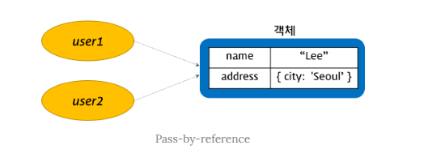

# 모던자바스크립트 DeepDive 11장 : 원시값과 객체 비교

## 원시값

### 변경불가능한 값

**자바스크립트에서 원시값은 변경 불가능한 값이다**

- 한번 생성된 원시값은 리드온리로서 변경 불가능하다

**변수와 값은 구분해서 생각하기**

- 변수
  - 하나의 값을 저장하기 위해 확보한 메모리 공간 또는 식별자
- 값
  - 변수에 저장된 데이터로서 표현식에 평가되어 생성된 결과

**변경 불가능한것은 변수가 아니라 값에 대한 진술**

- 값은 변경불가능하다라는 대전제는?
- 아래 코드에서 o로 선언한 변수를 조작불가능하다는것이지, o로 선언하고 할당한 객체 `{}` 내부를 변경불가능하다는 말이 아니다.

```js
const o = {}
/* const로 선언한 변수에 할당한 원시 값은 변경 불가 */
/*  하지만 변수에 할당한 객체는 변경가능 */
0.a = 1;
console.log(0); // {a : 1}
```

**원시값의 값의 변경 1**

- 첫번째 구문 실행 시 메모리에 문자열 `'Hello'`가 값으로써 생성된다
  - 두번째 구문 실행 시 이전에 생성된 문자열 `'Hello'`를 수정하는 것이 아니라 새로운 문자열 `'world'`를 메모리에 생성하고 식별자 `str`은 이것을 가리키고 있는 것
- 이때 문자열 `'Hello'`와 `'world'`모두 메모리에 존재하고 있다
  - 원시값은 유효하고 변수 `str`이 문자열 `"Hello"`를 가리키고 있다가 `"world"`를 가르키도록 변경되었을 뿐이다.

```js
var str = "Hello";
str = "world";
```

**원시값의 값의 변경 2**

- `String` 객체의 `slice()` 메서드는 변수에 저장된 문자열을 변경하는 것이 아니라
- **새로운 문자열을 생성하고 반환한다**
- 이유는?

  - **`string`**은 변경할 수 없는 **immutable value**이기 때문

    ```jsx
    var statement = "I am an immutable value"; // string은 immutable value
    var otherStr = statement.slice(8, 17);

    console.log(otherStr); // 'immutable'
    console.log(statement); // 'I am an immutable value'
    ```

**원시값이 아닌 참조타입인 배열의 값의 변경은?**

- 객체인 배열 arr은 `push`메서드에 의해 업데이트 되고 `v2`에는 배열의 새로운 `Length`값이 반환된다
- 이유는?
  - 배열은 객체이고 객체는 `immutable Value`가 아닌 변경가능한(=`mutable`) 값이기 때문

```js
var arr = [];
console.log(arr.length); // 0

var v2 = arr.push(2); // arr.push()는 메소드 실행 후 arr의 length를 반환
console.log(arr.length); // 1
```

**user.name의 값을 변경했으나 변수 myName의 값은 변경되지않았다**

- 왜일까?
  - `myName`에 `user.name`을 할당했을 때 `user.name`의 참조를 할당하는 것이 아니라 불변한 값 `‘Lee’`가 메모리에 생성되고 `myName`은 이것을 참조하기 때문
    - 즉 `user.name`이 변경된다 하더라도 변수 `myName(string 타입)`에는 변화가 없다

```jsx
var user = {
  name: "Lee",
  address: {
    city: "Seoul",
  },
};

var myName = user.name; // 변수 myName은 string 타입이다.

user.name = "Kim";
console.log(myName); // Lee

myName = user.name; // 재할당
console.log(myName); // Kim
```

**user2에 name 프로퍼티에 새로운 값을 할당하면 객체는 변경 불가한 값이 아니므로 user2는 변경된다**

- 그런데 변경하지 않는 `user1`도 동시에 변경된다
- 이는 둘이 같은 주소를 참조하고 있기 때문에!

```js
var user1 = {
  name: "Lee",
  address: {
    city: "Seoul",
  },
};

var user2 = user1; // 변수 user2는 객체 타입이다.

user2.name = "Kim";

console.log(user1.name); // Kim
console.log(user2.name); // Kim
```

<br />



<br />

### Object.assign

**타겟 객체로 소스 객체의 프로퍼티를 복사**

- 이때 소스 객체의 프로퍼티와 동일한 프로퍼티를 가진 타겟 객체의 프로퍼티들은 **덮어쓰기**된다

```jsx
Object.assign(target, ...sources);
```

**Object.assign 사용 예시**

```jsx
// Copy
const obj = {a: 1};
const copy = Object.assign({}, obj);
console.log(copy); // { a: 1 }
console.log(obj == copy); // false

// Merge
const o1 = {a: 1};
const o2 = {b: 2};
const o3 = {c: 3};

const merge1 = Object.assign(o1, o2, o3);

console.log(merge1); // { a: 1, b: 2, c: 3 }
console.log(o1); // { a: 1, b: 2, c: 3 }, 타겟 객체가 변경된다!

// Merge
const o4 = {a: 1};
const o5 = {b: 2};
const o6 = {c: 3};

const merge2 = Object.assign({}, o4, o5, o6);

console.log(merge2); // { a: 1, b: 2, c: 3 }
console.log(o4); // { a: 1 }
```

`**Object.assign`을 사용하여 기존 객체를 변경하지 않고 객체를 복사하여 사용 가능\*\*

- `user1`과 `user2`는 `address`를 공유하지 않으므로
- 한 객체를 변경하여도 다른 객체에 영향을 주지 않는다

```jsx
const user1 = {
  name: "Lee",
  address: {
    city: "Seoul",
  },
};

/* 새로운 빈 객체에 user1을 copy한다. */
const user2 = Object.assign({}, user1);
/* user1과 user2는 참조값이 다르다. */
console.log(user1 === user2); // false

user2.name = "Kim";
console.log(user1.name); // Lee
console.log(user2.name); // Kim

/* 객체 내부의 객체(Nested Object)는 Shallow copy된다. */
console.log(user1.address === user2.address); // true

user1.address.city = "Busan";
console.log(user1.address.city); // Busan
console.log(user2.address.city); // Busan
```
