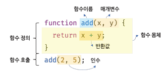
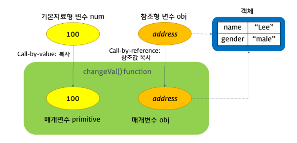

# 모던자바스크립트 DeepDive 12장 : 함수

## 함수란?

**함수정의**

- 함수란, 일련의 과정을 문(`Statement`)로 구현하고 **코드 블록으로 감싸서 하나의 실행단위로 정의한것**
- 함수는 이름과 매개변수를 가지며 필요할 때 호출하여 블록에 담긴 문들을 일괄적으로 실행 할 수 있게한다

```js
/* 함수의 정의(함수 선언문) */
function square(number) {
  return number * number;
}
```

**여기서 함수의 정의만으로 함수가 실행되는것은 ❌**

- `argument`를 `parameter`를 통해 함수에 전달하면서 함수의 실행을 **명시적으로 지시** 해야한다
- 이를 함수호출이라 함

```js
/* 함수의 호출 */
const result = square(2, 5);

/*함수 square에 인수 2,5를 전달하며 호출하면 반환값 10을 반환 */
console.log(result); // 10
```

### 함수의 구성 요소

**매개변수**

- 함수 내부로 전달받는 변수(`Parameter`)

**인수**

- 매개변수에 대한 입력(`Arguments`)

**출력**

- 반환값 (`Return Value`)

<br />



<br />

## 함수 정의

**함수를 정의하는 방식에는 3가지가 존재한다.**

- 함수 선언문
- 함수 표현식(& 표현식의 일부인 화살표 함수)
- Function 생성자 함수

### 함수 선언문

**정의한 함수는 `function` 키워드와 아래의 내용으로 구성**

- 함수명 : 함수 선언문으로 작성 시 함수명은 생략 ❌
- 매개변수 목록 : 0개 이상의 목록으로 괄호를 감싸고 콤마로 구분
- 함수 몸체 : 함수가 호출되었을 때 실행되는 문들의 집합 중괄호로 문을감싼 후 `return` 문으로 결과값을 반환 할 수 있다

```jsx
/* 함수 선언문 */
function square(number) {
  return number * number;
}
```

### 함수 표현식

**함수는 객체타입의 값**

- 따라서 함수는 **값처럼 변수에 할당 할 수 도 있고 프로퍼티의 값이 될 수도 있으며 배열의 요소가 될 수도 있다**
- 이처럼 값의 성질을 갖는 객체를 **일급객체**라 명명(=함수)

**함수는 일급 객체이므로 함수 리터럴로 생성한 함수 객체를 변수에 할당 가능**

- 이러한 함수 정의 방식을 함수 표현식이라고 한다

```jsx
// 함수 표현식
var square = function (number) {
  return number * number;
};
```

**함수 표현식 방식에선 정의한 함수는 생략할 수 있으며 이를 익명함수라 함**

- 함수 표현식 에서는 함수명을 생략하는 것이 일반적

```jsx
// 기명 함수 표현식(named function expression)
var foo = function multiply(a, b) {
  return a * b;
};

// 익명 함수 표현식(anonymous function expression)
var bar = function (a, b) {
  return a * b;
};

console.log(foo(10, 5)); // 50
console.log(multiply(10, 5)); // Uncaught ReferenceError: multiply is not defined
```

**함수는 앞에 말했듣이 변수에 할당이 가능한데, 해당 변수는 함수명이 아니라 할당된 변수를 가리키는 참조값을 저장한다**

- 따라서 호출 시 함수명이아니라 변수명을 사용해야한다

```jsx
var foo = function (a, b) {
  return a * b;
};

var bar = foo;

console.log(foo(10, 10)); // 100
console.log(bar(10, 10)); // 100
```

### 화살표 함수

**함수표현식보다 더 간결한 문법으로 함수를 만들수 있다**

```jsx
let func = (args1,args2) = > expression
```

**인자 args1,args2를 받는 함수가 만들어진다**

- 즉 아래 함수의 축약 버전

```jsx
let func = function (arg1, arg2, ...argN) {
  return expression;
};
```

**그런데 평가해야 할 표현식이나 구문이 여러 개일 경우?**

- 표현식 내부에 중괄호를 삽입 후 `return`을 사용해서 결괏값을 명시적으로 반환해줘야한다

```jsx
let sum = (a, b) => {
  /* 중괄호는 본문 여러 줄로 구성되어 있음을 알려줍니다. */
  let result = a + b;
  return result; // 중괄호를 사용했다면, return 지시자로 결괏값을 반환해주어야 합니다.
};

alert(sum(1, 2)); // 3
```

```jsx
let sum = (a, b) => {
  /* 중괄호는 본문 여러 줄로 구성되어 있음을 알려줍니다 */
  let result = a + b;
  return result; // 중괄호를 사용했다면, return 지시자로 결괏값을 반환해주어야 합니다.
};

alert(sum(1, 2)); // 3
```

### Function 생성자 함수

**함수 선언문과 함수 표현식은 모두 함수 리터럴 방식으로 함수를 정의하는데 이것은 결국 내장 함수 Function 생성자 함수로 함수를 생성하는 것을 단순화시킨 short-hand(축약법)**

- 일반적으로 `Function` 생성자 함수로 생성하는 방식은 일반적으로 사용 X

```js
var square = new Function("number", "return number * number");
console.log(square(10)); // 100
```

## 함수의 생성과 호이스팅

**정의 방식은 달라도 결국 세가지 방식 모두 Function생성자 함수를 통해 함수를 생성한다**

**함수선언문에서의 호이스팅**

- 아래 코드는 함수선언문으로 작성되었는데 함수가 정의되기 전에 호출이 가능하다

- 함수 선언문의 경우에는 선언 위치와는 상관없이 코드 내 **어느곳에서든 호출이 가능**한데 이를 **함수 호이스팅**이라한다

**함수 선언문으로 정의 된 함수**

- 자바스크립트 엔진이 스크립트가 로딩 되는 시점에 바로 초기화하고 이를 변수 객체에 저장
  - **함수 선언 과 초기화 및 할당이 동시에 이루어진다**
- 그렇기 때문에 함수 선언 위치 와 상관없이 호이스팅된다

```jsx
/*함수선언문*/

var res = square(5); //호출가능!

function square(number) {
  return number * number;
}
```

**함수표현식에서의 호이스팅은?**

- 함수 선언문과 달리 `TypeError`가 발생한다

- 함수 표현식의 경우 함수 호이스팅이 아니라 변수 호이스팅이 발생

```jsx
var res = square(5); // TypeError: square is not a function

var square = function (number) {
  return number * number;
};
```

### 함수의 호출

**`함수명()`으로 호출한다**

### 매개변수와 인수

**함수를 실행하기 위해 필요한 값을 함수 외부에서 내부로 전달할 필요가 있는 경우**

- 매개변수를 통해서 ~ 인수를 전달한다

```jsx
//함수 선언문
function add(x, y) {
  return x + y;
}

/* 함수 호출 */
/* 인수 1과 2가 매개변수 x와 y에 할당되고 실행 */
var result = add(1, 2); // 여기서 1,2는 인수로 매개변수로 전달하는 값
```

**매개변수는 함수 몸체 내부에서만 참조 가능**

```jsx
function add(x, y) {
  console.log(x, y); // 2 5
  return x + y;
}

add(2, 5); //add 함수의 매개변수 x,y는 함수 몸체 내부에서만 참조할 수 있다
console.log(x, y); // x is not defined
```

**함수는 매개변수와 인수의 개수가 일치하는지 체크 X**

- 인수가 부족해 인수가 할당되지 않으면 매개변수의 값은 `undefined`가 된다

```jsx
function add(x, y) {
  return x + y;
}

console.log(add(2)); // NaN (2+undefined이기 때문)
```

**만약 매개변수가 인수보다 더 많은 경우? 마지막값은 무시된다**

```jsx
function add(x, y) {
  return x + y;
}

console.log(add(2, 3, 5)); //7    마지막 인수 5는 무시
```

### Return

**함수는 `return` 키워드와 표현식(반환값)으로 이루어진 반환문을 사용해 실행결과를 함수 외부로 반환 할 수 있다**

- 반환문은 `return` 키워드 뒤에 오는 표현식을 평가해 반환하는데
- `return`키워드 뒤에 반환값으로 사용할 표현식을 명시적으로 지정하지 않으면 `undefined`가 반환된다

```jsx
function add() {
  return;
}

console.log(add()); //undefined
```

## 참조에 의한 전달과 외부 상태의 변경

원시타입 인수는 ⇒ 값에 의한 전달 (\***\*Call-by-value\*\***)

객체형(참조형)는 ⇒ 참조에 의한 호출 (**call by reference**)

### call-by-value (값에 의한 전달)

**원시 타입 인수는 call-by-value로 동작**

- 함수 호출 시 원시 타입 인수를 함수에 매개변수로 전달할 때
- 매개변수에 값을 복사하여 함수로 전달하는 방식
- 이때 함수 내에서 매개변수를 통해 값이 변경되어도 전달이 완료된 원시 타입의 값은 변하지않는다

```jsx
function foo(primitive) {
  primitive += 1;
  return primitive;
}

var x = 0;

console.log(foo(x)); // 1
console.log(x); // 0
```

### call-by-reference (참조에 의한 호출)

**객체형 인수는 call-by-refernce로 동작**

- 함수 호출 시 참조 타입 인수를 함수에 매겨변수로 전달 시 매개변수에 값이 복사되지않고 객체의 참조값이 매개변수에 저장되어 함수로 전달되는 방식
- 이때 함수 내부에서 매개변수의 참조값이 사용되어 객체의 값이 변경 시 전달되어진 참조형의 인수값도 함께 변경된다.
  - 아래 코드에서 원시 타입 인수는 값을 복사해 매개변수에 전달하므로 함수 몸체에서 값이 변경되어도 어떠한 부수효과가 발생 ❌
  - 그러나 객체형 인수는 참조값을 매개변수에 전달하므로 그 값이 변경될 경우 원본 객체의 값또한 변경되는 부수효과가 발생한다.

```js
function changeVal(primitive, obj) {
  primitive += 100;
  obj.name = "Kim";
  obj.gender = "female";
}

var num = 100;
var obj = {
  name: "Lee",
  gender: "male",
};

console.log(num); // 100
console.log(obj); // Object {name: 'Lee', gender: 'male'}

changeVal(num, obj);

console.log(num); // 100
console.log(obj); // Object {name: 'Kim', gender: 'female'}
```

<br />



<br />

## 다양한 함수의

### 즉시 실행 함수 IIFE

**함수 정의와 동시에 호출되는 함수**

- 단 한번만 호출되며 다시 호출 **X**

```js
(function () {
  const a = 3;
  const b = 2;
  return a * b;
})(); // ()로 감싸고 중괄호 끝에 ()
```

**즉시 실행 함수도 일반 함수와 같이 값을 반환할수도 있고 인수를 전달 받을 수도 있다**

```js
const res = (function () {
  const a = 3;
  const b = 2;
  return a + b;
})();

console.log(res); //5

res = (function (a, b) {
  return a + b;
})(3, 5); //3,5를 인수로 전달

console.log(res); //5
```

### 재귀함수

**자기 자신을 호출하는 함수**

- 재귀 함수는 자신을 무한히 연쇄 호출하므로
- 호출을 멈출 수 있는 **탈출 조건을 반드시 만들어야 함**

```js
/* 피보나치 수열 */
/* 피보나치 수는 0과 1로 시작하며, 다음 피보나치 수는 바로 앞의 두 피보나치 수의 합이 된다. */
/* 0, 1, 1, 2, 3, 5, 8, 13, 21, 34, 55, 89, 144, 233, 377, 610, ... */
function fibonacci(n) {
  if (n < 2) return n;
  return fibonacci(n - 1) + fibonacci(n - 2); //자기자신을 호출
}

console.log(fibonacci(0)); // 0
console.log(fibonacci(1)); // 1
console.log(fibonacci(2)); // 1
console.log(fibonacci(3)); // 2
console.log(fibonacci(4)); // 3
console.log(fibonacci(5)); // 5
console.log(fibonacci(6)); // 8

/* 팩토리얼 */
/* 팩토리얼(계승)은 1부터 자신까지의 모든 양의 정수의 곱이다. */
/* n! = 1 * 2 * ... * (n-1) * n */
function factorial(n) {
  if (n < 2) return 1;
  return factorial(n - 1) * n;
}

console.log(factorial(0)); // 1
console.log(factorial(1)); // 1
console.log(factorial(2)); // 2
console.log(factorial(3)); // 6
console.log(factorial(4)); // 24
console.log(factorial(5)); // 120
console.log(factorial(6)); // 720
```

### 콜백함수

**함수를 명시적으로 호출하는 방식이 아니라 특정 이벤트가 발생했을때 시스템에 의해 호출되는 함수**

- 함수의 매개변수를 통해 다른 함수 내부로 전달되는 함수
- 콜백 함수가 자주 사용되는 대표적인 예는 이벤트 핸들러 처리

```jsx
<!DOCTYPE html>
<html>
<body>
  <button id="myButton">Click me</button>
  <script>
    var button = document.getElementById('myButton');
    button.addEventListener('click', function() {
      console.log('button clicked!');
    });
  </script>
</body>
</html>
```

**콜백 함수는 매개변수를 통해 전달되고 전달받은 함수의 내부에서 어느 특정시점에 실행**

- 콜백 함수는 주로 비동기식 처리 모델(Asynchronous processing model)에 사용

- `setTimeout`의 첫번째 인수인 콜백 함수는
  - 두번째 매개변수에 전달된 시간이 경과되면
  - 첫번째 매개변수에 전달한 콜백 함수가 호출

```js
setTimeout(function () {
  console.log("1초 후 출력된다.");
}, 1000);
```
