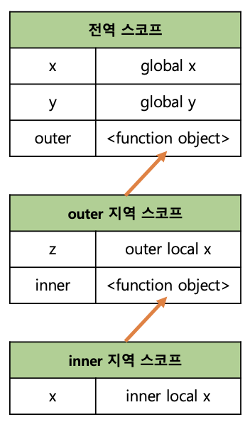

# 모던자바스크립트 DeepDive 13장 : 스코프

## 스코프 정의

**스코프란?**

- 함수의 매개변수는 함수 몸체 내부에서만 참조할 수 있고 함수 외부에서 참조 불가하다
  - 이러한 범위를 나타내는게 스코프이다.

```js
function add(x, y) {
  /* 매개변수 함수 몸체 내부에서만 참조 할 수 있다 */
  /* 즉, 매개변수와 스코프(유효 범위)는 함수 몸체 내부다. */
  console.log(x, y);
  return x + y;
}

add(2, 5);

/* 매개변수는 함수 몸체 내부에서만 참조 할 수 있다 */
console.log(x, y); // ReferenceError : x is not defined
```

### 만약 변수가 전역변수로도 쓰이고 지역변수로도 중복선언이 된다면?

**변수 x가 중복선언되었다고 가정할 때**

- 전역에서 변수 x를 참조할때, 그리고 함수 내부에서 변수 x를 참조할때
- 이름이 중복된 2개의 변수 중 어떤 변수를 참조해야할까?
- 또 자바스크립트는 어떻게 변수를 식별할까?

**스코프는 참조 대상 식별자(identifier, 변수, 함수의 이름과 같이 어떤 대상을 다른 대상과 구분하여 식별 할 수 있는 유일한 이름)를 찾아내기 위한 규칙**

- 자바스크립트는 이 규칙대로 식별자를 찾는다
- 전역 변수 `x`는 어디에서는 참조 가능 그러나 함수 `foo` 내에 선언된 변수 `x`는 함수 내부에서만 참조할 수 있으며, 함수 외부에서는 참조 X
  - 따라서 이때 두개의 x변수는 식별자의 이름은 동일하지만 자신의 유효한 범위, 즉 **스코프가 다른 별개의 변수이다**

```js
var x = "global"; //선언이 중복된 함수!

function foo() {
  var x = "function scope";
  console.log(x);
}

foo(); // ? function scope
console.log(x); // ? global
```

### 스코프의 구분

**스코프는 두가지로 나뉜다**
| 전역스코프(Global scope) | 지역 스코프(Local scope) |
| --- | --- |
| 코드 어디서든 참조 가능 | 함수 코드블록 내 스코프로 함수 자신과 하위 함수에서만 참조 가능 |

**또한 모든 변수는 스코프를 가지는데 변수의 관점에서 스코프를 구분하면 2가지로 나뉠 수 있다**

| 전역 변수(Global variable)                | 지역 스코프(Local variable)                                            |
| ----------------------------------------- | ---------------------------------------------------------------------- |
| 전역에서 선언된 변수 어디에서든 참조 가능 | 함수내에서 선언된 변수이며 그지역과 그지역의 하부 지역에서만 참조 가능 |

**따라서 변수는 선언위치에 의해 스코프를 가지게 된다**

- 전역에서 선언된 변수
  - 전역 스코프를 가지는 전역 변수
- 지역에서 선언된 변수
  - 지역 스코프를 가지는 지역 변수

## 스코프 체인

**함수는 전역에서도 정의 가능하고 함수 몸체 내부에서 정의할 수도 있다**

- 함수 몸체 내부에서 함수가 정의 된 것을
  - **함수의 중첩**
- 중첩 함수를 포함하는 함수를
  - **외부 함수**

**함수는 중첩될 수 있으므로 함수의 지역스코프도 중첩될 수 있다**

- **이는 스코프가 함수의 중첩에 의해 계층 구조**를 갖는다는것을 의미
- 아래 코드에서 지역은 외부 함수의 지역과 내부 함수의 지역이 존재
  - 즉 **내부함수**는 **외부함수의 중첩함수**
  - **외부 함수가 만든 지역 스코프**는 **내부 함수가 만든 지역 스코프**의 **상위스코프**가 된다 (외부함수 > 내부함수)

```js
var x = "전역 변수 x";
var y = "전역 변수 y";

function 외부함수() {
  var z = "외부함수의 지역변수 z";

  console.log(x); // '전역 변수 x';
  console.log(y); // '전역 변수 y';
  console.log(z); // '외부함수의 지역변수 z';

  function 내부함수() {
    var x = "내부함수의 지역변수 x";

    console.log(x); // '내부함수의 지역변수 x;
    console.log(y); // 전역 변수 y;
    console.log(z); // 외부함수의 지역변수 z;
  }

  내부함수();
}

외부함수();

console.log(x); // 전역 변수 x;
console.log(z); // z is not defined;
```

<br />



<br />

**이렇게 모든 스코프는 하나의 계층적 구조로 연결된다**

- 모든 지역 스코프의 **최상위 스코프는 전역 스코프**이다
- 이렇게 스코프가 계층적으로 연결된 것을 뭐라고 부르냐?
  - **스코프 체인**

**변수 참조 시 자바스크립트는 스코프 체인을 통해 변수를 참조하는 코드의 스코프에서 시작하여 ➡️상위 스코프 방향으로 이동하며 선언된 변수를 검색**

- 이를 통해 상위 스코프에서 선언한 변수를 하위 스코프에서도 참조할 수 있다.

### 자바스크립트 스코프의 특징

**자바스크립트는 다른 언어와 달리 함수레벨 스코프를 따른다**

- 함수레벨 스코프
  - 함수 코드 블록 내 선언된 변수는 함수 코드 블록 내에서만 유효하고 블록 외부에서는 참조 불가❌
  - 단 `let` 키워드를 사용하면 블록레벨스코프를 사용할 수 있다

```js
/* let를 이용한 참조 */
var x = 0;
{
  var x = 1;
  console.log(x); // 1
}
console.log(x); // 1

let y = 0;
{
  let y = 1;
  console.log(y); // 1
}
console.log(y); // 0
```

## 렉시컬 스코프

**아래 코드의 결과는 `bar` 함수의 상위 스코프가 무엇인지에 따라 결정된다**

- 함수를 어디서 호출했는지에 따라 상위 스코프가 결정된다
- 함수를 어디에서 정의했는지에 따라 상위 스코프가 결정된다
  - 둘 중 자바스크립트에선 어떤 방식이 맞을까?
- 첫번째 방식을 동적 스코프라 하며 함수를 정의하는 시점에 함수가 어디서 호출될지 알 수 없다
  - 함수가 호출되는 시점에 동적으로 상위스코프가 결정되므로 동적스코프라 한다
- 두번째 방식을 렉시컬스코프 혹은 정적스코프라 하낟
  - 함수를 어디서 호출했는지가 아니라 함수를 어디서 정의했는지에 따라 함수의 상위 스코프가 결정된다.
- 자바스크립트는 두번째 방식, 즉 렉시컬 스코프를 따른다
  - 즉, 자바스크립트는 함수가 어디서 호출된 위치는 함수의 상위 스코프 결정에 어떠한 영향도 끼치지 않는다 ❌
  - 함수의 **상위스코프**는 언제나 **자신이 정의된 스코프**이다

```js
var x = 1; //전역변수

function foo() {
  //전역스코프 foo
  var x = 10;
  bar();
}

function bar() {
  //전역스코프 bar
  console.log(x);
}

foo(); // 1
bar(); // 1
```

**함수정의(함수 선언문 또는 표현식)이 실행되고 생성된 함수 객체는 이렇게 결정된 상위 스코프를 기억한다**

- 함수가 호출될 때마다 함수의 상위 스코프를 참조할 필요가 있기 때문
- 위 코드를 다시보면 `bar`함수는 전역에서 정의된 함수이다
  - 함수 선언문으로 정의된 `bar`함수는 전역코드가 실행되기 전에 평가되어 함수객체를 생성한다
  - 이때 생성된 함수 객체는 자신이 정의된 스코프(현재는 전역 스코프)를 기억한다.
  - `bar`함수가 호출되면 호출된곳이 어디인가에 상관없이 기억하고 있는 전역스코프를 상위 스코프로 사용한다
  - 따라서 해당 코드는 전역변수 `x`의 값을 기억하고 두번 출력하게 된다.
