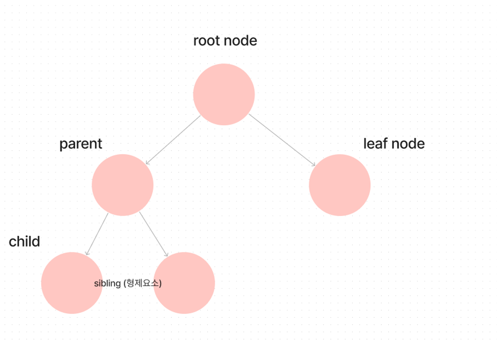
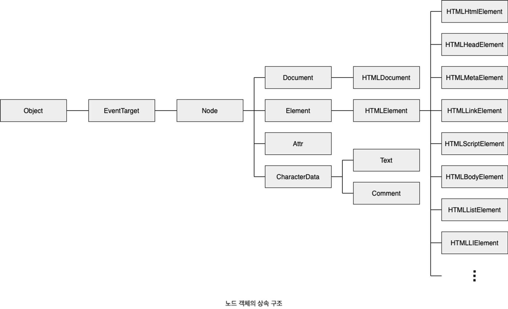

# 개요

**모던자바스크립트 DeepDive 39.1 노드 ~ 39.5 요소노드와 텍스트조작 까지 기술 (677p ~ 714p )**

**DOM (Document Obejct Model)**

- HTML 문서의 계층적 구조와 정보를 표현
- 이를 제어할 수 있는 API 제공
- 프로퍼티와 메서드를 제공하는 하나의 자료구조

## 노드

### HTML 요소와 노드 객체

**HTML 요소**

- HTML 문서를 구성하는 개별적 요소
- 렌더링엔진에 의해 파싱되 DOM을 구성하는 요소 노드 객체로 변환
  - 이때 HTML 요소의 어트리뷰트는 어트리뷰트 노드
  - HTML 요소의 텍스트 콘텐츠는 텍스트 노드로 변환



_HTML 요소와 구조_

**HTML 문서는 HTML 요소들의 집합이다**

- HTML 요소들은 중첩관계를 가짐
- 중첩관계에 의해 계층적인 부자관계가 형성(parent-child)
  - 이러한 부자관계를 반영해 HTML 요소를 객체화한 모든 노드 객체들을 트리 자료구조료 구성

> 💡 **트리 자료 구조**

**트리자료구조란?**

- 노드들의 계층 구조로 구성
- 트리자료구조는 하나의 최상위 노드에서 시작된다
- 최상위노드는 부모노드가 없으며 루트노드라 한다
- 루트노드는 n개 이상의 자식 노드를 가진다
- 자식노드가 없는 노드를 리프노드라 한다



_트리 자료 구조_

**DOM**

- **노드 객체들로 구성된 트리 자료구조**
- 노드 객체의 트리로 구조화되어있으므로 DOM을 **DOM 트리**라고 부르기도 한다

### 노드 객체의 타입

**노드 객체**

- 노드 객체는 계층적인 구조로 구성
- 노드 객체는 종류와 상속
- 노드 객체는 총 12개의 종류(노드타입)을 가진다
- 중요한 노드 타입 4가지 기술

**문서노드(document node)**

- DOM 트리 최상위 존재하는 루트 노드
- `document` 객체 자체를 가리킨다
  - 전역객체 `window`의 `document` 프로퍼티에 바인딩되어 있다
  - 따라서 문서노드는 `window.document` 혹은 `document`로 참조할 수 있다
- HTML 문서 당 `document`객체는 단 하나로 유일하다
- 문서노드는 DOM 트리의 노드들에 접근하기 위한 진입접 역할을 한다
  - 요소,어트리뷰트, 텍스트 노드에 접근 시 문서노드를 통해 접근해야한다

**요소 노드 (element node)**

- HTML 요소를 가리키는 객체
- 문서의 구조를 표현하는 역할을 한다

**어트리뷰트 노드 (attribute node)**

- HTML 요소의 어트리뷰트를 가르키는 객체
- 어트리뷰트 노드는 어트리뷰트가 지정된 HTML 요소의 요소노드와 연결되어 있다
  - 단, 요소노드는 부모 노드와 연결되어 있지만 어트리뷰트 노드는 부모 노드와 연결되어있지않고, 요소노드에만 연결되어 있다
  - 요소노드의 형제 노드 ❌
    - 따라서 접근시 어트리뷰트 노드에 접근하여 어트리뷰트를 참고하거나 먼저 요소노드에 접근해야 한다

**텍스트 노드 (text node)**

- HTML 요소의 텍스트를 가리키는 객체
- 문서의 정보를 표현하는 역할
- 텍스트 노드는 요소 노드의 자식 노드이며 자식노드를 가질 수 없는 리프노드
- DOM 트리의 최하단에 위치한다
  - 따라서 접근시 먼저 부모 노드인 요소 노드에 접근해야한다

### 노드 객체의 상속 구조

**DOM을 구성하는 노드객체는**

- 자신의 구조와 정보를 제어할 수 있는 DOM API 사용 가능
  - 이를 통해 노드 객체는 자신의 부모, 형제,자식을 탐색할 수 있다
  - 자신의 어트리뷰트와 텍스트 또한 조작 가능
- 노드 객체는 표준 빌트인 객체가 ❌
  - 브라우저 환경에서 추가적으로 제공되는 호스트 객체
    - 그러나 노드객체도 자바스크립트 객체이므로 프로토타입에 의한 상속 구조를 가짐


_노드 객체의 상속구조_

**요소노드 객체또한 다양한 프로토타입 체인의 상속을 받는다**

- 이러한 특성을 나타내는 기능들을 상속을 통해 제공받는다

| input 요소 노드 객체의 특성                                 | 프로토타입을 제공하는 객체 |
| ----------------------------------------------------------- | -------------------------- |
| 객체                                                        | Obejct                     |
| 이벤트를 발생시키는 객체                                    | EventTarget                |
| 트리 자료구조의 노드 객체                                   | Node                       |
| 브라우저가 렌더링 할 수 있는 웹 문서의 요소를 표현하는 객체 | Element                    |
| 웹 문서의 요소 중 HTML 요소를 표현하는 객체                 | HtmlElement                |
| HTML 요소 중 input 요소를 표현하는 객체                     | HTMLInputElement           |

**DOM은 DOM API를 제공한다**

- 노드 타입에 따라 필요한 기능을 프로퍼티와 메서드의 집합으로 표현한 구조 ➡️ DOM API
  - **DOM API를 통해 HTML 구조나 내용 또는 스타일을 동적으로 조작할 수 있게된다**
- 중요한것은 DOM이 제공하는 프로퍼티와 메서드를 사용해 노드에 접근하고 HTML 구조나 내용,스타일을 동적으로 변경하는 방법을 학습하는것
  - HTML을 DOM과 연관지어 바라보기

## 요소 노드 취득

**HTML의 내용 또는 스타일등을 동적으로 조작하려면?**

- 우선 요소 노드를 취득해야함
- 요소 노드 취득은 모든 HTML 요소를 조작하는 시작점

### id를 이용한 요소 노드 취득

**document.prototype.getElementById**

- 인수로 전달한 `id` 어트리뷰트 값을 갖는 하나의 요소 노드를 탐색해 반환
- `getElementById`는 `document.prototype`의 프로퍼티이므로 반드시 `document`를 통해 참조해야함
- `id` 값은 HTML 문서내 유일한 값이어야 하며, 공백문자를 구분하여 여러 개의 값을 가질 수 ❌
  - 그러나 중복으로 존재해도 에러는 발생 하지않지만 `getElementById` 는 인수로 전달된 id 값을 가지는 첫번째 요소 노드만 반환한다
- 만약 인수로 전달된 `id`값을 가지는 HTML 요소가 존재하지않을 경우 `null`이 반환된다

```tsx
/* 첫번째 id 요소가 파싱 되 생성된 요소 노드가 반환*/
const elem = document.getElementById("banana");
```

**주의점**

- HTML 요소에 id 어트리뷰트 부여 시 id 값과 동일한 이름의 전역변수가 암묵적으로 선언되고 해당 노드 객체가 할당되는 부수효과가 존재
  - 단, id값과 동일한 이름의 전역변수가 이미 선언되어 있을시 이 전역변수에 노드 객체가 재할당 되지는 ❌

```tsx
<div id = "foo"></div>

/* script */

let foo = 1;

**/* id값과 동일한 이름의 전역변수가 이미 선언되어 있으면 노드 객체가 재할당 되지 ❌*/
console.log(foo) // 1**
```

### 태그를 이용한 요소 노드 취득

**Document.prototype.getElementByTagName**

- 인수로 전달한 태그 이름을 가지는 모든 요소 노드들을 탐색해 반환
- `HTMLCollection` 객체를 반환한다
  - 유사배열 객체이면서 이터러블이다
- 만약 인수로 전달된 태그 이름을 가지는 요소가 존재하지않을 경우 비어있는 `HTMLCollection`을 반환한다

```tsx
<li>1</li>
<li>2</li>
<li>3</li>

/* script */
const elements = document.getElementsByTagName('li')

/* HTMLColletion(3) [li,li,li ]*/
console.log(elements)
```

### class를 이용한 요소 노드 취득

**Document.prototype.getElementsByClassName**

- 인수로 전달한 클래스 이름을 가지는 모든 요소노드들을 탐색해 반환
- `HTMLCollection` 객체를 반환한다
- 만약 인수로 전달된 태그 이름을 가지는 요소가 존재하지않을 경우 비어있는 `HTMLCollection`을 반환한다

```tsx
<li class="number">1</li>
<li class="number">2</li>
<li class="number">3</li>

/* script */
const elements = document.getElementsByTagName('li')

/* HTMLColletion(3) [li,li,li ]*/
console.log(elements)
```

### CSS 선택자를 이용한 요소 노드 취득

**Docuemnt.prototype/Element.prototype.querySelector**

- 인수로 전달한 CSS 선택자를 만족시키는 하나의 요소노드를 탐색 후 반환
- 인수로 전달한 CSS 선택자가 동일하게 존재할경우 가장 첫번째 요소노드만 반환
- 인수로 전달한 CSS 선택자를 만족시키는 요소노드가 존재하지 않을경우 `null`을 반환
- 인수로 전달한 CSS 선택자가 문법에 맞지않는 경우 `DOMException` 에러 발생

**Docuemnt.prototype/Element.prototype.querySelectorAll**

- 인수로 전달한 CSS 선택자를 만족시키는 모든 요소노드를 탐색해 반환
  - 반환값 ➡️ `NodeList`
    - 해당 노드리스트는 유사배열객체이며 이터러블이다
- 인수로 전달한 CSS 선택자를 만족시키는 요소가 존재하지 않을시 비어있는 `NodeList`를 반환
- 인수로 전달한 CSS 선택자가 문법에 맞지않는 경우 `DOMException` 에러 발생

### 특정 요소 노드를 취득할 수 있는지 확인

**Element.prototype.matches**

- 인수로 전달한 CSS 선택자를 통해 특정 요소 노드를 취득할 수 있는 불리언 값을 반환한다
- 해당 메서드는 이벤트 위임을 사용할 때 유용

```tsx
<ul id="friuts">
  <li class="apple">apple</li>
  <li class="banana">banana</li>
  <li class="orange">orange</li>
</ul>;

/* script */
const apple = document.querySelector(".apple");

/* apple 요소 노드는 #fruits > li.apple로 취득할 수 있다 */
console.log(apple.matches("#fruits > li.apple")); // true
```

### HTMLCollection과 NodeList

**HTMLCollection/ NodeList**

- DOM API가 여러 개의 결과값을 반환하기 위한 DOM 컬렉션 객체
- 모두 유사배열 객체이며 이터러블
  - 그러므로 `for-of`문으로 순회할 수 있으며, 전개연산자로 배열로 변환할 수 있다

**HTMLCollection/ NodeList의 중요한 특징**

- 노드 객체의 상태변화를 **실시간**으로 **반영**하는 **살아있는 객체**
  - 단, NodeList는 대부분의 경우 노드 객체의 상태 변화를 실시간으로 반영하지 않고, 과거의 정적 상태를 유지하는 non-live 객체로 동작하지만 경우에 따라 live로 동작할때도 있다

> 💡 **HTML Collection**

**HTMLCollection 객체는 살아있는 DOM 컬렉션 객체**

- 노드객체의 상태변화를 실시간으로 반영한다
  - 따라서 부수효과를 발생시킬 필요가 있어 그대로 사용하는 것은 ❌
  - 전개연산자로 배열로 만들고 ➡️ 해당 배열 내에서 DOM 조작

```tsx
/* 유사배열객체를 일반 배열로 변환*/
[...elements].forEach((elem) => (elem.className = "blue"));
```

> 💡 **NodeList**

**NodeList 주의점**

- `NodeList`는 `HTMLCollection`에 비해 비교적 안전하나 이또한 경우에따라 live 객체로 동작할 수 있음
- 따라서 전개연산자를 통해 배열로 변환시키거나 `Array.from`를 통해 배열로 변환시키는게 필요하다
