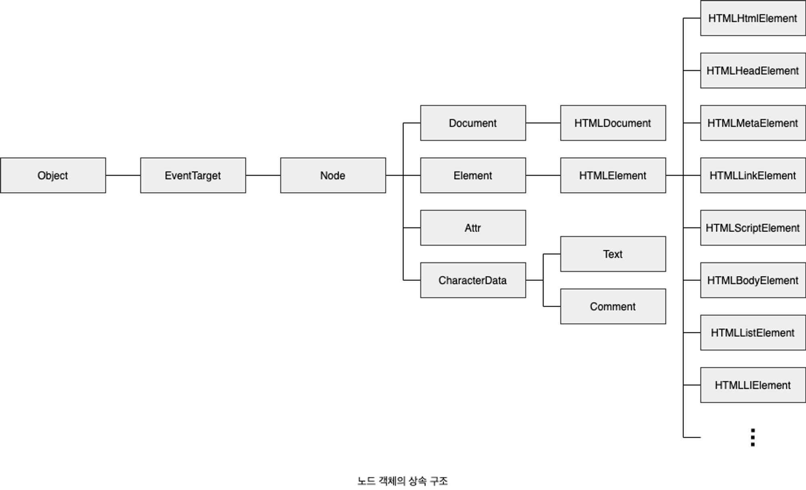
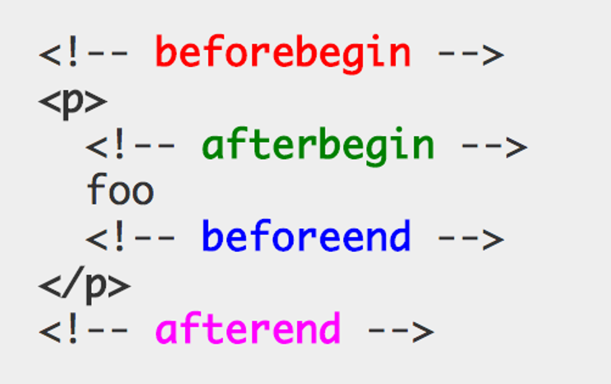

# 개요

**모던자바스크립트 DeepDive 39.1 노드 ~ 39.5 요소노드와 텍스트조작 까지 기술 (677p ~ 714p )**

**DOM (Document Obejct Model)**

- HTML 문서의 계층적 구조와 정보를 표현
- 이를 제어할 수 있는 API 제공
- 프로퍼티와 메서드를 제공하는 하나의 자료구조

## 노드

### HTML 요소와 노드 객체

**HTML 요소**

- HTML 문서를 구성하는 개별적 요소
- 렌더링엔진에 의해 파싱되 DOM을 구성하는 요소 노드 객체로 변환
  - 이때 HTML 요소의 어트리뷰트는 어트리뷰트 노드
  - HTML 요소의 텍스트 콘텐츠는 텍스트 노드로 변환

**HTML 문서는 HTML 요소들의 집합이다**

- HTML 요소들은 중첩관계를 가짐
- 중첩관계에 의해 계층적인 부자관계가 형성(parent-child)
  - 이러한 부자관계를 반영해 HTML 요소를 객체화한 모든 노드 객체들을 트리 자료구조료 구성

> 💡 **트리 자료 구조**

**트리자료구조란?**

- 노드들의 계층 구조로 구성
- 트리자료구조는 하나의 최상위 노드에서 시작된다
- 최상위노드는 부모노드가 없으며 루트노드라 한다
- 루트노드는 n개 이상의 자식 노드를 가진다
- 자식노드가 없는 노드를 리프노드라 한다


_트리 자료 구조_

**DOM**

- **노드 객체들로 구성된 트리 자료구조**
- 노드 객체의 트리로 구조화되어있으므로 DOM을 **DOM 트리**라고 부르기도 한다

### 노드 객체의 타입

**노드 객체**

- 노드 객체는 계층적인 구조로 구성
- 노드 객체는 종류와 상속
- 노드 객체는 총 12개의 종류(노드타입)을 가진다
- 중요한 노드 타입 4가지 기술

**문서노드(document node)**

- DOM 트리 최상위 존재하는 루트 노드
- `document` 객체 자체를 가리킨다
  - 전역객체 `window`의 `document` 프로퍼티에 바인딩되어 있다
  - 따라서 문서노드는 `window.document` 혹은 `document`로 참조할 수 있다
- HTML 문서 당 `document`객체는 단 하나로 유일하다
- 문서노드는 DOM 트리의 노드들에 접근하기 위한 진입접 역할을 한다
  - 요소,어트리뷰트, 텍스트 노드에 접근 시 문서노드를 통해 접근해야한다

**요소 노드 (element node)**

- HTML 요소를 가리키는 객체
- 문서의 구조를 표현하는 역할을 한다

**어트리뷰트 노드 (attribute node)**

- HTML 요소의 어트리뷰트를 가르키는 객체
- 어트리뷰트 노드는 어트리뷰트가 지정된 HTML 요소의 요소노드와 연결되어 있다
  - 단, 요소노드는 부모 노드와 연결되어 있지만 어트리뷰트 노드는 부모 노드와 연결되어있지않고, 요소노드에만 연결되어 있다
  - 요소노드의 형제 노드 ❌
    - 따라서 접근시 어트리뷰트 노드에 접근하여 어트리뷰트를 참고하거나 먼저 요소노드에 접근해야 한다

**텍스트 노드 (text node)**

- HTML 요소의 텍스트를 가리키는 객체
- 문서의 정보를 표현하는 역할
- 텍스트 노드는 요소 노드의 자식 노드이며 자식노드를 가질 수 없는 리프노드
- DOM 트리의 최하단에 위치한다
  - 따라서 접근시 먼저 부모 노드인 요소 노드에 접근해야한다

### 노드 객체의 상속 구조

**DOM을 구성하는 노드객체는**

- 자신의 구조와 정보를 제어할 수 있는 DOM API 사용 가능
  - 이를 통해 노드 객체는 자신의 부모, 형제,자식을 탐색할 수 있다
  - 자신의 어트리뷰트와 텍스트 또한 조작 가능
- 노드 객체는 표준 빌트인 객체가 ❌
  - 브라우저 환경에서 추가적으로 제공되는 호스트 객체
    - 그러나 노드객체도 자바스크립트 객체이므로 프로토타입에 의한 상속 구조를 가짐



_노드 객체의 상속구조_

**요소노드 객체또한 다양한 프로토타입 체인의 상속을 받는다**

- 이러한 특성을 나타내는 기능들을 상속을 통해 제공받는다

| input 요소 노드 객체의 특성                                 | 프로토타입을 제공하는 객체 |
| ----------------------------------------------------------- | -------------------------- |
| 객체                                                        | Obejct                     |
| 이벤트를 발생시키는 객체                                    | EventTarget                |
| 트리 자료구조의 노드 객체                                   | Node                       |
| 브라우저가 렌더링 할 수 있는 웹 문서의 요소를 표현하는 객체 | Element                    |
| 웹 문서의 요소 중 HTML 요소를 표현하는 객체                 | HtmlElement                |
| HTML 요소 중 input 요소를 표현하는 객체                     | HTMLInputElement           |

**DOM은 DOM API를 제공한다**

- 노드 타입에 따라 필요한 기능을 프로퍼티와 메서드의 집합으로 표현한 구조 ➡️ DOM API
  - **DOM API를 통해 HTML 구조나 내용 또는 스타일을 동적으로 조작할 수 있게된다**
- 중요한것은 DOM이 제공하는 프로퍼티와 메서드를 사용해 노드에 접근하고 HTML 구조나 내용,스타일을 동적으로 변경하는 방법을 학습하는것
  - HTML을 DOM과 연관지어 바라보기

## 요소 노드 취득

**HTML의 내용 또는 스타일등을 동적으로 조작하려면?**

- 우선 요소 노드를 취득해야함
- 요소 노드 취득은 모든 HTML 요소를 조작하는 시작점

### id를 이용한 요소 노드 취득

**document.prototype.getElementById**

- 인수로 전달한 `id` 어트리뷰트 값을 갖는 하나의 요소 노드를 탐색해 반환
- `getElementById`는 `document.prototype`의 프로퍼티이므로 반드시 `document`를 통해 참조해야함
- `id` 값은 HTML 문서내 유일한 값이어야 하며, 공백문자를 구분하여 여러 개의 값을 가질 수 ❌
  - 그러나 중복으로 존재해도 에러는 발생 하지않지만 `getElementById` 는 인수로 전달된 id 값을 가지는 첫번째 요소 노드만 반환한다
- 만약 인수로 전달된 `id`값을 가지는 HTML 요소가 존재하지않을 경우 `null`이 반환된다

```tsx
/* 첫번째 id 요소가 파싱 되 생성된 요소 노드가 반환*/
const elem = document.getElementById("banana");
```

**주의점**

- HTML 요소에 id 어트리뷰트 부여 시 id 값과 동일한 이름의 전역변수가 암묵적으로 선언되고 해당 노드 객체가 할당되는 부수효과가 존재
  - 단, id값과 동일한 이름의 전역변수가 이미 선언되어 있을시 이 전역변수에 노드 객체가 재할당 되지는 ❌

```tsx
<div id = "foo"></div>

/* script */

let foo = 1;

**/* id값과 동일한 이름의 전역변수가 이미 선언되어 있으면 노드 객체가 재할당 되지 ❌*/
console.log(foo) // 1**
```

### 태그를 이용한 요소 노드 취득

**Document.prototype.getElementByTagName**

- 인수로 전달한 태그 이름을 가지는 모든 요소 노드들을 탐색해 반환
- `HTMLCollection` 객체를 반환한다
  - 유사배열 객체이면서 이터러블이다
- 만약 인수로 전달된 태그 이름을 가지는 요소가 존재하지않을 경우 비어있는 `HTMLCollection`을 반환한다

```tsx
<li>1</li>
<li>2</li>
<li>3</li>

/* script */
const elements = document.getElementsByTagName('li')

/* HTMLColletion(3) [li,li,li ]*/
console.log(elements)
```

### class를 이용한 요소 노드 취득

**Document.prototype.getElementsByClassName**

- 인수로 전달한 클래스 이름을 가지는 모든 요소노드들을 탐색해 반환
- `HTMLCollection` 객체를 반환한다
- 만약 인수로 전달된 태그 이름을 가지는 요소가 존재하지않을 경우 비어있는 `HTMLCollection`을 반환한다

```tsx
<li class="number">1</li>
<li class="number">2</li>
<li class="number">3</li>

/* script */
const elements = document.getElementsByTagName('li')

/* HTMLColletion(3) [li,li,li ]*/
console.log(elements)
```

### CSS 선택자를 이용한 요소 노드 취득

**Docuemnt.prototype/Element.prototype.querySelector**

- 인수로 전달한 CSS 선택자를 만족시키는 하나의 요소노드를 탐색 후 반환
- 인수로 전달한 CSS 선택자가 동일하게 존재할경우 가장 첫번째 요소노드만 반환
- 인수로 전달한 CSS 선택자를 만족시키는 요소노드가 존재하지 않을경우 `null`을 반환
- 인수로 전달한 CSS 선택자가 문법에 맞지않는 경우 `DOMException` 에러 발생

**Docuemnt.prototype/Element.prototype.querySelectorAll**

- 인수로 전달한 CSS 선택자를 만족시키는 모든 요소노드를 탐색해 반환
  - 반환값 ➡️ `NodeList`
    - 해당 노드리스트는 유사배열객체이며 이터러블이다
- 인수로 전달한 CSS 선택자를 만족시키는 요소가 존재하지 않을시 비어있는 `NodeList`를 반환
- 인수로 전달한 CSS 선택자가 문법에 맞지않는 경우 `DOMException` 에러 발생

### 특정 요소 노드를 취득할 수 있는지 확인

**Element.prototype.matches**

- 인수로 전달한 CSS 선택자를 통해 특정 요소 노드를 취득할 수 있는 불리언 값을 반환한다
- 해당 메서드는 이벤트 위임을 사용할 때 유용

```tsx
<ul id="friuts">
  <li class="apple">apple</li>
  <li class="banana">banana</li>
  <li class="orange">orange</li>
</ul>;

/* script */
const apple = document.querySelector(".apple");

/* apple 요소 노드는 #fruits > li.apple로 취득할 수 있다 */
console.log(apple.matches("#fruits > li.apple")); // true
```

### HTMLCollection과 NodeList

**HTMLCollection/ NodeList**

- DOM API가 여러 개의 결과값을 반환하기 위한 DOM 컬렉션 객체
- 모두 유사배열 객체이며 이터러블
  - 그러므로 `for-of`문으로 순회할 수 있으며, 전개연산자로 배열로 변환할 수 있다

**HTMLCollection/ NodeList의 중요한 특징**

- 노드 객체의 상태변화를 **실시간**으로 **반영**하는 **살아있는 객체**
  - 단, NodeList는 대부분의 경우 노드 객체의 상태 변화를 실시간으로 반영하지 않고, 과거의 정적 상태를 유지하는 non-live 객체로 동작하지만 경우에 따라 live로 동작할때도 있다

> 💡 **HTML Collection**

**HTMLCollection 객체는 살아있는 DOM 컬렉션 객체**

- 노드객체의 상태변화를 실시간으로 반영한다
  - 따라서 부수효과를 발생시킬 필요가 있어 그대로 사용하는 것은 ❌
  - 전개연산자로 배열로 만들고 ➡️ 해당 배열 내에서 DOM 조작

```tsx
/* 유사배열객체를 일반 배열로 변환*/
[...elements].forEach((elem) => (elem.className = "blue"));
```

> 💡 **NodeList**

**NodeList 주의점**

- `NodeList`는 `HTMLCollection`에 비해 비교적 안전하나 이또한 경우에따라 live 객체로 동작할 수 있음
- 따라서 전개연산자를 통해 배열로 변환시키거나 `Array.from`를 통해 배열로 변환시키는게 필요하다

## 노드 탐색

**노드 탐색**

- 요소 노드 취득 후 취득한 요소를 기점으로 DOM 트리의 노드를 옮기며 부모,형제,자식 노드등을 탐색할 수 있다
- DOM트리 상의 노드를 탐색할 수 있도록 자바스크립트 엔진은 Node,Element 트리 탐색 프로퍼티를 제공한다

**node**

- parentNode
- previousSibling
- firstChild
- childNodes

**elemnt**

- previousElementSibling
- nextElementSibling

**노드 탐색프로퍼티는 모두 접근자 프로퍼티이다**

- 단, 노드 탐색 프로퍼티는 setter 없이 getter만 존재하여 참조만 가능한 읽기전용 접근자프로퍼티

### 공백 텍스트 노드

**HTML 요소 사이 스페이스, 탭 , 개행등의 공백문자또한 텍스트 노드를 생성**

- 이를 공백텍스트 노드라 한다

### 자식 노드 탐색

**자식노드 탐색을하기 위해선, 다음과 같은 노드 탐색 프로퍼티를 사용**

| 프로퍼티                                                                | 설명                                                               |
| ----------------------------------------------------------------------- | ------------------------------------------------------------------ |
| Node.prototype.childNodes                                               | 자식 노드를 모두 탐색해 NodeList에 담아 반환                       |
| NodeList엔 요소노드 뿐만아니라 텍스트 노드도 포함될 수 있다             |
| Node.prototype.children                                                 | 자식 노드중에서 요소 노드만 모두 탐색해 HTMLCollection에 담아 반환 |
| children 프로퍼티가 반환한 HTMLCollection에는 텍스트 노드가 포함되지 ❌ |
| Node.prototype.firstChild                                               | 첫번째 자식노드를 반환                                             |
| 반환한 자식노드는 텍스트노드이거나 요소노드일 수 있다                   |
| Node.prototype.lastChild                                                | 마지막 자식노드를 반환                                             |
| 반환한 자식노드는 텍스트노드이거나 요소노드일 수 있다                   |
| Element.prototype.firstElementChild                                     | 첫번째 자식 요소 노드를 반환                                       |
| Element.prototype.lastElementChild                                      | 마지막 자식 요소 노드를 반환                                       |

### 자식 노드 존재 확인

**Node.prototype.hasChildNodes**

- 자식 노드가 존재하는지 확인
- 불리언으로 반환
  - 텍스트 노드를 포함해 자식노드의 존재를 확인
  - 텍스트노드를 제외해서 확인하려면 `children.length` 혹은 `childElementCount` 사용

```tsx
<ul id="friuts">f</ul>

<!-- script -->
const fruits = document.getElementById("friuts");

fruits.hasChildNodes() //true

```

### 요소 노드의 텍스트 노드 탐색

**firstChild 프로퍼티**

- 요소노드의 텍스트노드는 요소노드의 자식노드
  - 따라서 요소노드의 텍스트노드는 firstChild 프로퍼티로 접근 가능
  - 첫번째 자식노드를 반환
  - 프로퍼티가 반환한 노드는 텍스트노드이거나 요소노드이다

```tsx
<div id="foo">Hi</div> 
  /* script */

  docuemnt.getElementById("foo").firstChild; // Hi
```

### 부모 노드 탐색

**Node.prototype.parentNode**

- 텍스트 노드는 DOM 트리 마지막 리프노드이므로 부모노가 텍스트 노드인경우는 ❌

```tsx
<ul class="numbers">
  <li class="apple"></li>
</ul>;

/* script */
const apple =
  document.querySelector(".apple") 
  /* li클래스의 부모노드는 ul이다*/
  apple.parentNode; // ul number
```

### 형제노드 탐색

**부모노드가 같은 형제노드 탐색시 아래 표와 같은 프로퍼티를 사용**

- 단, 어트리뷰트 노드는 요소노드와 연결되어있지만 부모노드가 같은 형제노드가 아니므로 반환 ❌
  - 즉, 텍스트노드 및 요소노드만 반환

| 프로퍼티                             | 설명                             |
| ------------------------------------ | -------------------------------- |
| previousSibling                      | 부모노드가 같은 형제 노드 중에서 |
| 자신의 이전 형제 노드를 탐색 후 반환 |
| nextSibling                          | 부모노드가 같은 형제 노드 중에서 |
| 자신의 다음 형제노드를 탐색 후 반환  |
| previousElementsSibling              | 부모노드가 같은 형제 노드 중에서 |

자신의 이전 형제 노드를 탐색 후 반환
(요소노드만 반환) |
| nextElementsSibling | 부모노드가 같은 형제 노드 중에서
자신의 다음 형제 노드를 탐색 후 반환
(요소노드만 반환) |

## 노드 정보 취득

**노드객체에 대한 정보 취득시 아래 표에 있는 노드 정보 프로퍼티를 사용**

| 프로퍼티 | 설명                             |
| -------- | -------------------------------- |
| nodeType | 노드 타입을 나타내는 상수를 반환 |
| nodeName | 노드이름을 문자열로 반환         |

→ 요소노드 : 대문자열로 태그이름 반환 (”UL”, “LI”)
→ 텍스트노드 : 문자열 “#text” 반환
→ 문서노드 : 문자열 “#document”를 반환 |

## 요소 노드의 텍스트 조작

### nodeValue

**nodeValue 프로퍼티는 이전과 달리 참조와 할당이 모두 가능하다**

- 노드 객체의 `nodeValue` 프로퍼티 참조시 노드 객체의 값을 반환
  - 텍스트 노드의 텍스트를 반환한다는 의미
  - 텍스트노드가 아닌 노드의 `nodeValue` 프로퍼티 참조 시 `null`을 반환
- 그냥 쓸일없다

### textContent

**textContent**

- getter/setter 둘다 존재
  - 요소노드의 텍스트와 모든 자손 노드의 텍스트를 모두 취득하거나 변경가능-
    - 즉 참조시 부모 태그내에 있는 태그들을 무시하고 전부참조한다

```tsx
<div id="foo">
  Hello
  <span>World</span>
</div>;

/* script */

const foo =
  docuemnt.getElementById(
    "foo"
  ) /* #foo 요소 노드의 텍스트를 모두 취득 / 이때 HTML 마크업은 무시 */ 
  foo.textContent; // Hello World
```

## DOM 조작

**DOM 조작이란?**

- 새로운 노드를 생성해 DOM에 추가하거나 기존 노드를 삭제 또는 교체하는 것
  - DOM 조작에의해 새로운 노드가 추가되거나 삭제시 리플로우와 리페인트가 발생

### innerHTML

**innerHTML**

- 요소 노드의 HTML 마크업을 취득(get)하거나 변경(set)한다
- 요소노드의 `innerHTML` 프로퍼티에 문자열 할당 시 요소 노드의 모든 자식 노드가 제거되고, 할당한 문자열에 포함되어 있는 HTML 마크업이 파싱되어 요소노드의 자식노드로 DOM에 반영

```tsx
<div id="foo">
  Hello
  <span>World</span>
</div>;

/* script */

const foo =
  docuemnt.getElementById(
    "foo"
  ) /* #foo 요소 노드의 텍스트를 모두 취득 / 이때 HTML 마크업은 무시 */ 
  foo.innerHTML; // Hello <span>World!</span> World
```

**innerHTML 사용 시 HTML 마크업 문자열로 DOM 조작이 가능하다**

```tsx
<ul class="fruits">
  <li class="apple">Apple</li>
</ul>;

/* script */

const fruits = docuemnt.getElementByClassName("fruits");

/* 노드 추가 */
fruits.innerHTML += '<li class="banana">banana</li>';

/* 노드 교체 */
fruits.innerHTML = '<li class="orange">orange</li>';

/* 노드 삭제 */
fruits.innerHTML = "";
```

💡 **innerHTML의 문제점**

**크로스 사이트 스크립팅 공격에 취약하다**

- HTML 마크업 내부에 자바스크립트 악성 코드가 포함되어 있을 시 파싱과정에서 그대로 실행될 가능성이 있기 때문

**문제점2**

- 요소노드의 `innerHTML` 프로퍼티에 HTML 마크업 문자열을 할당하는 경우
  - 요소 노드의 모든 자식 노드를 제거하고 할당한 HTML 문자열을 파싱해 DOM을 변경한다는것
  - 아래코드에선 자식요소 `li.banana`를 추가하고 있다
  - 이때 `fruits`의 자식요소 `apple`은 아무런 변경이없으므로 다시 생성할 필요 또한 ❌
  - 그러나 `innerHTML`은 내부 자식요소를 전부 삭제하기때문에 `+=`연산자로 다시 `apple`를 만들고 거기에 `banana`를 추가하는것이다
  - 이는 효율적이지 ❌

```tsx
<ul class="fruits">
  <li class="apple">Apple</li>
</ul>;

/* script */

const fruits = docuemnt.getElementByClassName("fruits");
fruits.innerHTML += '<li class="banana">banana</li>';
```

**문제점3**

- 새로운 요소 삽입시 삽입될 위치를 지정할 수 없다
- 아래코드와 li.apple과 li.orange 사이에 노드를 삽입하고 싶지만 `innerHTML`은 할 수 ❌
- 이를 해결하기 위해 **insertAdjacentHTML 메서드 존재**

```tsx
<ul class="fruits">
  <li class="apple">Apple</li>
  /* innerHTML은 중간에 삽입 ❌ */
  <li class="orange">orange</li>
</ul>
```

### insertAdjacentHTML 메서드

**insertAdjacentHTML(postion,DOMstring)**

- 기존 요소를 제거하지 않으면서 위치를 지정해 새로운 요소를 삽입한다
- 두번째 인수로 전달한 HTML 마크업 문자열을 파싱 후 그결과로 생성된 노드를 첫번째 인수로 전달할 위치에 삽입해 DOM에 반영
- 첫번째 인수(postion)으로 전달할 수 있는 문자열은?
  - ‘beforebegin’
  - ‘afterbegin’
  - ‘beforeend’
  - ‘afterend’



**_insertAdjacentHTML postion_**

**단, insertAdjacentHTML 또한 크로스 사이트 스크립팅 공격에 취약하다는 점은 동일**

### 노드 삽입

**마지막노드로 추가**

- **`appendChild`**
  - 인수로 전달받은 노드를 자신을 호출한 노드의 마지막 자식노드로 DOM에 추가
  - 이때 노드는 추가할 위치를 지정할 수 없으며 언제나 마지막 자식 노드로 추가

```tsx
<ul class="fruits">
  <li class="apple">Apple</li>
  <li class="orange">orange</li>
</ul>;

/* script */
const li = document.createElement("li");

li.appendChild(document.createTextNode("Orange"));

/* li 요소 노드를 fruits 요소 노드의 마지막 자식으로 추가 */
document.getElementById("fruits").appendChild(li);
```

**지정한 위치에 노드 삽입**

- **`insertBefore(newNode, childNode)`**
  - 첫번째 인수로 전달받은 노드를 두번째 인수로 전달받은 노드 앞에 삽입
- 두번째 인수로 전달받은 노드는 반드시 `insertBofre` 메서드를 통해 호출한 노드의 자식노드 여야함
  - 아니면 `DOMException` 에러 발생
- 두번째 인수로 전달받은 노드가 `null`이라면, 첫번째 인수로 전달받은 노드를 `insertBefore` 메서드를 호출한 노드의 마지막 자식으로 추가
  - 즉, `appendChild`와 동일하게 동작

```tsx
<ul class="fruits">
	<li class="apple">Apple</li>
	<li class="orange">orange</li>
</ul>

/* script */
const fruits = document.getElementById('fruits')
const li = document.createElement('li');
li.appendChild(document.createTextNode('Orange'));

/* li 요소 노드를 fruits 요소 노드의 마지막 자식요소 앞에 삽입 */
fruits.inserBefore(li, fruits.lastElementChild)
```

### 노드 복사 (clone Node)

**Node.prototype.cloneNode([deep:true | false])**

- 노드의 사본을 생성해 반환
  - 매개변수 `deep`에 `true`를 인수로 전달 시 노드를 깊은 복사
  - 인수를 생략하거나 `false` 지정시 노드를 얕은 복사하여 노드 자신만의 사본을 생성
    - 얕은 복사로 생성된 요소는 자손노드를 복사하지않으므로 텍스트 노드도 존재 ❌

```tsx
<ul class="fruits">
  <li class="apple">Apple</li>
  <li class="orange">orange</li>
</ul>;

/* script */
const fruits = document.getElementById("fruits");
const apple = fruits.firstElementsChild;

/* apple노드를 얕은 복사해 사본을 생성, 텍스트 노드가 없는 사본이 생성됨 */
const shallowClone = apple.cloneNode();

/* fruits 노드를 깊은 복사해 사본을 생성 모든 자손노드가 포함되어 있음 */
const deepClone = fruits.cloneNode(true);
```

### 노드 교체

**Node.prototype.replaceChild(newChild, oldChild)**

- 자신을 호출한 노드의 자식 노드를 다른 노드로 교체
  - 첫번째 매개변수 `newChild`에 교체할 새로운 노드를 인수로 전달
  - 두번째 매개변수 `oldChild`에는 이미 존재하는 교체될 노드를 인수로 전달
    - `oldChild` 매개변수에 인수로 전달한 노드는 `replaceChild` 메서드를 호출한 노드의 자식 노드여야 한다

```tsx
<ul class="fruits">
	<li class="apple">Apple</li>
	<li class="orange">orange</li>
</ul>

/* script */
const fruits = document.getElementById('fruits')

const newChildNode = document.createElement('li')
newChild.textContent = 'Bananan';

/* fruits 요소 노드의 첫번째 자식 요소 노드를 newChild 요소 노드로 교체 */
fruits.replaceChild(newChildNode, fruits.fristElementChild)
```

### 노드 삭제

**Node.prototype.removeChild(child)**

- 인수로 전달한 노드를 DOM에서 삭제
  - 인수로 전달한 노드는 removeChild를 호출한 노드의 자식노드이어야 한다

```tsx
<ul class="fruits">
	<li class="apple">Apple</li>
	<li class="orange">orange</li>
</ul>

/* script */
const fruits = document.getElementById('fruits')

/* fruits 요소 노드의 마지막 요소를 DOM에서 삭제 */
fruits.removeChild(fruits.lastElementChild)
```

## 어트리뷰트

### 어트리뷰트 노드와 attributes 프로퍼티

**HTML 문서 구성 요소인 HTML 요소는 여러개의 속성을 가질 수 있다**

- HTML 어트리뷰트는 HTML 요소의 시작 태그에 어트리뷰트 이름=”어트리뷰트 값”형식으로 정의
- 글로벌 어트리뷰트(`id`,`class`,`style`,`title`,`hidden` 등)과 이벤트 핸들러 어트리뷰트(`onClick`, `onChange`, `onfocus`) 은 모든 HTML 요소에서 공통적으로 사용가능 하지만
  - 특정 HTML 요소에만 한정적으로 사용가능한 어트리뷰트도 존재
- 모든 어트리뷰트 노드의 참조는 유사배열객체이자 이터러블인 `NamedNodeMap` 객체에 담겨져, 요소 노드의 `attributes`프로퍼티에 저장됨

```tsx
/* user의 어트리뷰트 */
<input id="user" type="text" value="seju"></input>
```

**Element.prototype.attributes**

- 요소노드의 모든 어트리뷰트 노드를 어트리뷰트 노드의 참조가 담긴 NamedNodeMap 객체를 반환 받는다

```tsx
<input id="user" type="text" value="seju"></input>

/* script */

const {attributes} = document.getElementById('user');

/* NamedNodeMap {0 : id, 1 : type, 2: value, id: id, type: type, value : value, length :3}*/
console.log(attributes)
```

### 어트리뷰트 조작

**Element.prototype.getAttribute/setAttribute**

- `attributes`프로퍼티를 통하지 않고 요소 노드에서직접 메서드를 통해 HTML 요소의 어트리뷰트 값을 취득하거나 변경할 수 있어 편리
  - 참조 ➡️ `getAttribute`
  - 변경 ➡️ `setAttribute`

```tsx
<input id="user" type="text" value="seju"></input>

/* script */

/* getAttribute를 통해 input의 value를 취득 */
const input = document.getElementById('user')
const inputValue = input.getAttribute('value'); // seju

/* setAttribute를 통해 input 어트리뷰트를 변경 */
input.setAttribute('value', '손흥민')
console.log(input.getAttribute('value')) // 손흥민
```
