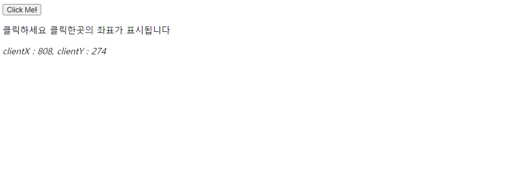

## 이벤트 드리븐 프로그래밍

**이벤트란?**

- 브라우저는 처리해야할 특정 사건 발생 시 이를 감지에 이벤트를 발생
  - 클릭,키보드입력,마우스 이동 등등

**이벤트 핸들러**

- 만약 애플리케이션이 특정 타입의 이벤트에 반응해 어떤 일을 하고 싶다면, 해당하는 타입의 이벤트가 발생했을 때 호출될 함수를 브라우저에게 알려 호출을 위임
- 이때 **이벤트 발생 시** **호출될 함수**를 **이벤트 핸들러**라 한다
- 이벤트 발생시 브라우저에게 **이벤트 핸들러의 호출을 위임**하는것을 **이벤트 핸들러 등록**이라 함
- 이벤트와 그 에 대응하는 이벤트핸들러를 통해 사용자와 애플리케이션은 상호작용할 수 있다
  - 이와 같이 프로그램의 흐름을 **이벤트 중심으로 제어하는 프로그래밍 방식**을 **이벤트 드리븐 프로그래밍**이라고한다

```jsx
<button>Click Me!</button>

**/* 이벤트 핸들러 */
const button = document.querySelector("button");
button.onclick = () => {
  console.log("Click");
};**
```

## 이벤트 타입

**이벤트타입이란?**

- 이벤트의 종류를 나타내는 문자열

### 마우스 이벤트

| 이벤트타입 | 이벤트 발생 시점                                  |
| ---------- | ------------------------------------------------- |
| click      | 마우스 버튼 클릭 시                               |
| dbClick    | 마우스 버튼 더블 클릭 시                          |
| mousedown  | 마우스 버튼을 눌렀을 때                           |
| mouseup    | 누르고 있던 마우스 버튼을 놓았을 때               |
| mousemove  | 마우스 커서를 움직였을 때                         |
| mouseenter | 마우스 커서를 HTML 요소 안으로 이동 시(버블링 ❌) |
| mouseover  | 마우스 커서를 HTML 요소 안으로 이동 시(버블링 ⭕) |
| mouseleave | 마우스 커서를 HTML 요소 밖으로 이동 시(버블링 ❌) |
| mouseout   | 마우스 커서를 HTML 요소 밖으로 이동 시(버블링 ⭕) |

### 키보드 이벤트

| 이벤트타입 | 이벤트 발생 시점                       |
| ---------- | -------------------------------------- |
| keydown    | 모든 키를 눌렀을 때 발생               |
| keypress   | 문자 키를 눌렀을 때 연속적으로 발생    |
| keyup      | 누르고 있던 키를 놓았을 때 한번만 발생 |

### 포커스 이벤트

**포커스 이벤트 핸들러 사용 시 유의점**

- 이벤트 핸들러 프로퍼티 방식으로 등록하면 크롬,사파리에서 정상 동작 ❌
  - 따라서 `addEventListener` 메서드 방식을 사용해 등록해야 한다

| 이벤트타입 | 이벤트 발생 시점                           |
| ---------- | ------------------------------------------ |
| focus      | HTML 요소가 포커스를 받았을 때 (버블링 ❌) |
| blur       | HTML 요소가 포커스를 잃었을 때 (버블링 ❌) |
| focusin    | HTML 요소가 포커스를 받았을 때 (버블링 ⭕) |
| focusout   | HTML 요소가 포커스를 잃었을 때(버블링 ⭕)  |

### 폼 이벤트

| 이벤트타입                                                              | 이벤트 발생 시점                                                                                      |
| ----------------------------------------------------------------------- | ----------------------------------------------------------------------------------------------------- |
| submit                                                                  | 1. form 요소 내의 input(checkbox,text,radio), select 입력 필드(textarea 제외)에서 엔터 키를 눌렀을 때 |
| 2. form 요소 내의 submit 버튼(<button>, <input type = ‘submit’> 클릭 시 |
| reset                                                                   | form 요소 내의 reset 버튼 클릭 시                                                                     |

### 값 변경 이벤트

**change 이벤트 유의점**

- `change` 이벤트는 `input` 이벤트와 달리 HTML 요소가 포커스를 잃었을 때 사용자 입력이 종료되었다고 인식하여 발생
  - 사용자 입력이 종료되어 값이 변경되면 `change` 이벤트가 발생한다

| 이벤트타입       | 이벤트 발생 시점                                                             |
| ---------------- | ---------------------------------------------------------------------------- |
| input            | input, select, textarea 요소의 값 입력 시                                    |
| change           | input,select,textarea 요소의 값 변경 시                                      |
| readystatechange | HTML 문서의 파싱 상태를 나타내는 document.readState 프로퍼티 값이 변경 될 때 |

### DOM 뮤테이션 이벤트

| 이벤트타입       | 이벤트 발생 시점                                             |
| ---------------- | ------------------------------------------------------------ |
| DOMContentLoaded | HTML 문서의 로드와 파싱이 완료되어 DOM 생성이 완료 되었을 때 |

### 뷰 이벤트

| 이벤트타입 | 이벤트 발생 시점                                       |
| ---------- | ------------------------------------------------------ |
| resize     | 브라우저 윈도우 크기를 리사이즈할 때 연속적으로 발생   |
| scorll     | 웹페이지 또는 HTML 요소를 스크롤 할 때 연속적으로 발생 |

### 리소스 이벤트

| 이벤트타입 | 이벤트 발생 시점                                                                         |
| ---------- | ---------------------------------------------------------------------------------------- |
| load       | DOMContentLoaded 이벤트 발생 시 모든 리소스의 로딩이 완료 시 (주로 window 객체에서 발생) |
| unload     | 리소스 언로드될 때 (주로 새로운 웹페이지 요청한 경우)                                    |
| abort      | 리소스 로딩 중단 시                                                                      |
| error      | 리소스 로딩 실패 시                                                                      |

## 이벤트 핸들러 등록

**이벤트 핸들러**

- 이벤트핸들러 등록하는 방법은 3가지가 존재한다

### 이벤트 핸들러 어트리뷰트 방식

**이벤트 핸들러 어트리뷰트**

- 이벤트 핸들러 어트리뷰트의 이름은 `onClick`과 같이 `on` 접두사와 이벤트의 종류를 나타내는 이벤트 타입으로 이루어져 있음
- 이벤트 핸들러 어트리뷰트 값으로 함수 호출문등의 문을 할당하면 이벤트핸들러가 등록된다
- 이벤트 핸들러 어트리뷰트 방식은 구식 현재는 사용 ❌
- VanliaJavascript 말고, Angular/react/vue와 같은 프레임워크/라이브러리에서는 이벤트 핸들러 어트리뷰트 방식으로 이벤트를 처리한다

```jsx
<button onclick="sayHi('Suwan')">Click Me!</button>;

function sayHi(name) {
  console.log(`${name}`);
}
```

### 이벤트 핸들러 프로퍼티 방식

**이벤트 핸들러 프로퍼티**

- `window` 객체와 `Document`,`HTMLElement` 타입의 `DOM` 노드 객체는 이벤트에 대응하는 이벤트 핸들러 프로퍼티를 가지고 있다
- 이벤트 핸들러 프로퍼티 키는 이벤트 핸들러 어트리뷰트와 마찬가지로 `on` 접두사와 이벤트 종류를 나타내는 이벤트 타입으로 이루어져 있다
- 이벤트 핸들러 프로퍼티에 함수를 바인딩하면 이벤트 핸들러가 등록된다

```tsx
<button>Click Me!</button>

/* script */

/* 이벤트 핸들러 */
const button = document.querySelector("button");
**button.onclick = function () {
  console.log("click!!");
};**
```

**이벤트 핸들러 등록시 3요소**

1. 이벤트 타겟
2. 이벤트 타입
3. 이벤트 핸들러

**이벤트 핸들러 프로퍼티의 단점**

- 하나의 이벤트 핸들러만 바인딩 할 수 있다

### addEventListener 메서드 방식

**EventTarget.prototype.addEventListener**

- 이벤트 핸들러를 등록할 수 있는 메서드
  - 첫번째 매개변수
    - 이벤트의 종류를 나타내는 문자열 이벤트 타입 전달
    - on 접두사가 붙지 않는다
  - 두번째 매개변수
    - 이벤트를 실행할 이벤트 핸들러
  - 마지막 매개변수
    - 옵션
    - 이벤트를 캐치할 이벤트 전파 단계를 지정

```tsx
<button>Click Me!</button>;

/* 이벤트 핸들러 */
const button = document.querySelector("button");
button.addEventListener("click", () => {
  console.log("button Click");
});
```

**addEventListener는 이벤트핸들러프로퍼티 방식과 달리 하나 이상의 이벤트핸들러를 등록할 수 있다**

- 이때 이벤트 핸들러는 등록된 순서대로 호출된다

```jsx
/* 이벤트 핸들러 */
/* 하나 이상의 이벤트 핸들러를 등록할 수 있다 */
const button = document.querySelector("button");

/* 각자 개별적으로 순서대로 실행된다 */
button.addEventListener("click", () => {
  console.log("button Click");
});

button.addEventListener("click", () => {
  console.log("button Click2");
});
```

**단, addEventListener 메서드를 통해 동일한 이벤트 핸들러 중복등록시 하나의 이벤트 핸들러만 등록**

```jsx
/* 참조가 동일한 이벤트 핸들러 중복 등록 시 */
const handleClick = () => {
  console.log("click");
};
button.addEventListener("click", handleClick);
button.addEventListener("click", handleClick);
```

## 이벤트 핸들러 제거

**EventTarget.prototype.removeEventListener 메서드**

- `addEventListener`로 등록한 이벤트 핸들러를 제거할 수 있다
- 전달할 인수는 `addEventListener` 메서드와 동일
  - 단 `addEventListener`와 `removeEventListener`메서드에 전달한 인수가 일치하지 않으면 이벤트 핸들러는 제거되지 않는다
- 무명함수로 이벤트핸들러로 등록하면 이벤트를 제거할 수 없다, 참조할 함수를 찾을 수 없기때문
- 이벤트 해들러 프로퍼티방식으로 등록한 이벤트 또한 `removeEventListener`메서드로 제거할 수 없다
  - 제거하려면 해당 이벤트핸들러 프로퍼티에 `null`을 할당해야한다

```tsx
<button>Click Me!</button>;

const handleClick = () => {
  console.log("click");
};
button.addEventListener("click", handleClick);

button.removeEventListener("click", handleClick);
```

## 이벤트 객체

**이벤트객체 생성**

- 이벤트 발생 시 이벤트에 관련된 다양한 정보를 담고 있는 이벤트 객체가 동적으로 생성
- 생성된 이벤트 객체는 이벤트 핸들러의 첫번째 인수로 전달된다
- `addEventListener` 메서드 방식이 아닌 이벤트 핸들러 어트리뷰트 방식으로 이벤트 등록시에는 `event`라는 이름으로 매개변수를 등록해야한다

```jsx
<p>클릭하세요 클릭한곳의 좌표가 표시됩니다</p>
<em class="message"></em>

/* 이벤트 객체 */
const message = document.querySelector(".message");
const showCoords = (e) => {
  message.textContent = `clientX : ${e.clientX}, clientY : ${e.clientY}`;
};
window.addEventListener("click", showCoords);
```



화면 클릭시 좌표가 화면에 렌더링

### 이벤트 객체의 상속 구조

**이벤트 발생시 이벤트타입에 따라 다양한 타입의 이벤트 객체가 생성됨**

- 이벤트 객체는 다음과 같은 상속구조를 가진다


_이벤트 객체의 상속구조_

**이벤트 발생 시 암묵적으로 생성되는 이벤트 객체도 생성자 함수에 의해 생성**

- 그리고 생성된 이벤트 객체는 생성자 함수와 더불어 생성되는 프로토타입으로 구성된 프로토타입 체인의 일원이 된다

### 이벤트 객체의 공통 프로퍼티

**Event.prototype에 정의되어 있는 이벤트 관련프로퍼티는 모든 파생 이벤트 객체에 상속된다**

- Event 인터페이스 관련된 프로퍼티는 모든 이벤트 객체가 상속받는 공통 프로퍼티

**이벤트 객체의 공통 프로퍼티**

| 공통프로퍼티  | 설명                                                                     | 타입          |
| ------------- | ------------------------------------------------------------------------ | ------------- |
| type          | 이벤트타입                                                               | string        |
| target        | 이벤트를 발생시킨 DOM 요소                                               | DOM 요소 노드 |
| currentTarget | 이벤트 핸들러가 바인딩 된 DOM 요소                                       | DOM 요소 노드 |
| eventPhase    | 이벤트 전파단계 0: 이벤트없음 1: 캡쳐링 단계 2: 타겟 단계 3: 버블링 단계 | number        |
| bubbles       | 이벤트를 버블링으로 전파하는지 여부                                      |

다음 이벤트는 bubbles : false로 버블링하지 않는다
포커스 이벤트 : focus/blur
리소스 이벤트 : load/unload/abort/error
마우스 이벤트 : mouseenter/mouseleave | boolean |
| cancelable | preventDefault 메서드를 호출하여 이벤트 기본동작을 취소할 수 있는지 여부 | boolean |
| defaultPrevented | preventDefault 메서드를 호출해 이벤트를 취소했는지 여부 | boolean |
| isTrusted | 사용자 행위에 의해 발생한 이벤트 인지 여부
click 혹은 dispatchEvent 메서드를 통해 인위적으로 발생시킨 이벤트인 경우 isTrusted 는 false이다 | boolean |
| timeStamp | 이벤트가 발생한 시각 | number |

### 마우스 정보 취득

**MouseEvent 타입 이벤트 객체 고유 프로퍼티들**

- 마우스 포인터의 좌표정보를 나타내는 프로퍼티
  - screenX/screenY, clientX/clientY , pageX/pageY , offsetX/offsetY
- 버튼 정보를 나타내는 프로퍼티
  - altKey, ctrlKey, shiftKey, button

### 키보드 정보 취득

**keyboardEvent 타입 이벤트 객체 고유 프로퍼티 들**

- altkey
- ctrlkey
- shiftkey
- metakey
- key
- keyCode

## 이벤트 전파

**이벤트전파란?**

- DOM 트리 상에 존재하는 DOM 요소 노드에서 발생한 이벤트는 DOM 트리를 통해서 전파되는 것
- `ul` 요소의 두번째 자식 요소인 `li` 요소 클릭 시 클릭이벤트가 발생
  - 이때 생성된 이벤트 객체는 이벤트를 발생시킨 DOM 요소인 이벤트 타겟을 중심으로 DOM트리를 통해 전파

```html
<ul class="fruits">
  <li class="apple"></li>
  <li class="banana"></li>
  <li class="orange"></li>
</ul>
```

**캡쳐링단계**

- 이벤트가 상위요소에서 하위요소방향으로 전파

**타겟단계**

- 이벤트가 이벤트 타겟에 도달

**버블링단계**

- 이벤트가 하위요소에서 상위요소 방향으로 전파

```jsx
fruits.addEventListener("click", (e) => {
  console.log(e.eventPhase); // 3
  console.log(e.target); // 내가 클릭한 li
  console.log(e.currentTarget); // 이벤트를 바인딩한 ul
});
```

**순서는?**

1. `li`요소 클릭 시 클릭 이벤트 발생 ➡️ 클릭 이벤트 객체가 생성되고 클릭된 `li` 요소가 이벤트 타겟
2. 클릭 이벤트 객체는 `window`에서 시작해 이벤트 타겟방향으로 전파 (캡쳐링)
3. 이벤트 객체는 이벤트를 발생시킨 이벤트 타겟에 도달 (타겟 단계)
4. 이벤트 객체는 이벤트 타겟에서 시작해 `window` 방향으로 전파 (버블링)

**이벤트는 이벤트를 발생시킨 이벤트 타깃은 물론 상위 DOM 요소에서도 캐치할 수 있다**

- DOM 트리를 통해 전파되는 이벤트는 이벤트 패스에 위치한 모든 DOM 요소에서 캐치할 수 있다

**대부분의 이벤트는 갭치령과 버블링을 통해 전파**

- 하지만 다음 이벤트는 버블링을 통해 전파되지않는다
  - 포커스이벤트 : focus/blur
  - 리소스 이벤트 : load/unload/abort/error
  - 마우스 이벤트 : mouseenter/mouseleave
- 위 이벤트들은 버블링되지 않으므로 이벤트 타깃의 상위 요소에서 위 이벤트를 캐치하려면 캡처링 단계의 이벤트를 캐치해야함
  - 하지만 대채할 수 있는 이벤트 존재
  - focus/blur ➡️ focusin/focusout
  - mouseenter/mouseleave ➡️ mouseover/mouseout
  - 해당 이벤트는 버블링을 통해 전파가 가능
  - 따라서 캡처링단계에서 이벤트를 캐치해야할 경우는 거의 없다

## 이벤트 위임

**이벤트 위임이란?**

- 여러개의 하위 DOM 요소에 각각 이벤트 핸들러를 등록하는 대신 하나의 상위 DOM 요소에 이벤트 핸들러를 등록하는 방법
- 이벤트 위임을 통해 target의 li요소가 아니면 리턴하고
- fruits의 `children` 즉 `li`요소들에대해 `forEach`를 돌면서 클래스이름을 토글하고있다
- 이때 이벤트 객체의 `currentTarget`은 언제나 `ul`을 가리키지만 `target`은 실제로 이벤트를 발생시킨 DOM요소 즉 클릭한 `li`를 가리키게 된다

```jsx
const fruits = document.querySelector(".fruits");

/* 이벤트 위임 */
function activate({target}) {
  if (!target.matches(".fruits > li")) return;
  [...fruits.children].forEach((fruit) => {
    fruit.classList.toggle("active", fruit === target);
  });
}

fruits.addEventListener("click", activate);
```

## DOM 요소의 기본 동작 조작

### DOM 요소 기본 동작 중단

**DOM 요소는 저마다 기본 동작이 존재한다**

- a 요소 클릭 시 href 어트리뷰트에 지정된 링크로 이동
- checkbox 클릭 시 체크 또는 해제

**preventDefault 메서드는 이러한 DOM 요소의 기본 동작을 중단한다**

```tsx
e.preventDefault();
```

### 이벤트 전파 방지

**stopPropagation 메서드**

- 이벤트 전파를 중지시킨다

## 이벤트 핸들러 내부의 this

### 이벤트 핸들러 어트리뷰트 방식의 this

**이벤트 핸들러 함수는 내부적으로 window전역객체를 가르킨다**

```jsx
<button onClick=handleClick()>Click</button>

/* script */
function handleClickNode() {
  console.log(this); // window
}
```

**이벤트 핸들러 어트리뷰트의 값으로 지정한 문자열은 암묵적으로 생성되는 이벤트 핸들러의 문**

- 따라서 handleClick 함수는 이벤트 핸들러에 의해 일반함수로 호출
  - 일반함수로 호출되는 함수 내부의 this는 전역객체를 바인딩한다
- 단, 이벤트 핸들러를 호출할때 인수로 전달한 this는 이벤트를 바인딩한 DOM 요소를 가리킨다

```tsx
<button onClick=handleClick(this)>Click</button>

/* script */
function handleClickNode(button) {
  console.log(button); // 이벤트를 바인딩한 button 요소
}
```

### 이벤트 핸들러 프로퍼티 방식과 addEventListener 메서드 방식

**둘다 this는 바인딩한 DOM 요소를 가르킨다**

- 즉, 이벤트 핸들러 내부의 this는이벤트 객체의 currentTarget의 프로퍼티와 같다

```jsx
const fruits = document.querySelector(".fruits");
fruits.addEventListener("click", consolePropagation);

function consolePropagation(e) {
  console.log(e.currentTarget);
  console.log(this === e.currentTarget); // true
}
```

**화살표 함수로 정의한 이벤트 핸들러 내부의 this**

- 상위 스코프의 `this`를 가리킴

```jsx
fruits.addEventListener("click", consolePropagation);

const consolePropagation = (e) => {
  console.log(this); // window
  console.log(this === e.currentTarget); // false
};
```

## 이벤트 핸들러에 인수 전달

**함수에 인수 전달 시 함수를 호출할때 전달해야함**

- 이벤트 핸들러 어트리뷰트 방식은 함수 호출문을 사용할 수 있기에 전달 가능
  - 그러나 핸들러 프로퍼티 방식과 `addEventListener`방식은 인수를 전달 ❌
    - 함수 호출문이아닌 함수 자체를 등록해야하기 때문에
- 따라서 클로저로 인수를 전달해야한다

```jsx
const MIN_USER_NAME_LENGTH = 5;
const userInput = document.querySelector(".user-input");
const $message = document.querySelector(".message2");

/* 인수를 성공적으로 전달할 수 있따 */
const checkUserNameLength = (min) => (e) => {
  $message.textContent =
    userInput.value.length < min ? `이름은 ${min}자 이상 입력해 주세요` : null;
  console.log(e); // event 객체가 정상적으로 바인딩됨
};

userInput.addEventListener("change", checkUserNameLength(MIN_USER_NAME_LENGTH));
```

## 커스텀 이벤트

### 커스텀 이벤트 생성

**Event,UIEvent,MouseEvent 같은 이벤트 생성자 함수로 호출해 명시적으로 생성한 이벤트 객체**

- 임의의 이벤트 타입을 지정할 수 있다
- 이처럼 개발자의 의도로 생성된 이벤트를 커스텀 이벤트라 한다

**이벤트 생성자 함수**

- 첫번째 인수로 이벤트 타입을 나타내는 문자열을 전달받는다
  - 이벤트 타입을 나타내는 문자열은 기존 이벤트 타입을 사용할 수도 있고, 기존 이벤트 타입이 아닌 임의의 문자열을 사용할 수 있다

```jsx
/* 커스텀 이벤트 생성 */
const keyboardEvent = new KeyboardEvent("keyup");
console.log(keyboardEvent.type); // 'keyup'

const customEvent = new CustomEvent("페이커");
console.log(customEvent.type); // '페이커'
```

**생성된 커스텀 이벤트 객체의 특징**

- 버블링되지 않는다
- `preventDefault` 메서드로 취소할 수 없다
  - 즉, `bubbles`와 `cancelbale` 프로퍼티 값이 `false`로 기본설정된다

```jsx
const customEvent = new CustomEvent("페이커");
console.log(customEvent.type); // '페이커'
console.log(customEvent.cancelable); // false
console.log(customEvent.bubbles); // false
```
