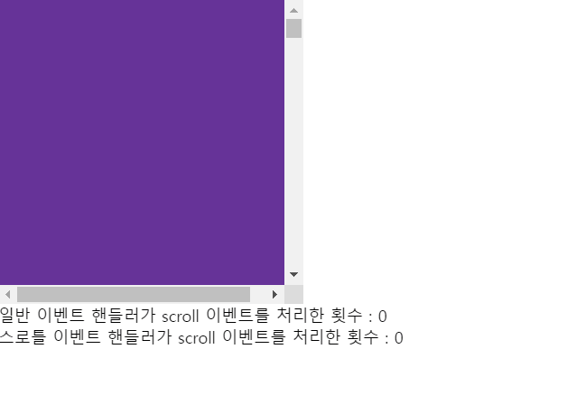

# 디바운스와 스로틀

## scroll,resize,input,mousemove와 같은 이벤트들은 짧은 시간 간격으로 연속해서 발생한다

- 이러한 이벤트들은 과도하게 호출되어 성능에 문제를 일으킬 수 있다
- 디바운스와 스로틀은 짧은 시간 간격으로 연속해서 발생하는 이벤트를 그룹화해 과도한 이벤트 핸들러의 호출을 방지하는 프로그래밍 기법

```js
/* 디바운스 코드 */
const debounce = (callback, delay) => {
  let timerId;
  return (...args) => {
    if (timerId) clearTimeout(timerId);
    timerId = setTimeout(callback, delay, ...args);
  };
};

/* 스로틀 코드 */
const throttle = (callback, delay) => {
  let timerId;
  return (...args) => {
    if (timerId) return;
    timerId = setTimeout(() => {
      callback(...args);
      timerId = null;
    }, delay);
  };
};

/* 클릭 이벤트 실행 */

$button.addEventListener("click", () => {
  $normalMsg.textContent = +$normalMsg.textContent + 1;
});

$button.addEventListener(
  "click",
  debounce(() => {
    $debounceMsg.textContent = +$debounceMsg.textContent + 1;
  }, 500)
);

$button.addEventListener(
  "click",
  throttle(() => {
    $throttleMsg.textContent = +$throttleMsg.textContent + 1;
  }, 500)
);
```

## 디바운스

### 디바운스란?

- 짧은 시간 간격으로 이벤트가 연속해서 발생하면 이벤트 핸들러를 호출하지 않다가 일정시간이 경과한 이후에 이벤트 핸들러가 한번만 호출되도록한다
  - 디바운스는 짧은 시간 간격으로 발생하는 이벤트를 그룹화해 마지막에 한번만 이벤트핸들러가 호출되도록 한다

### 텍스트 입력 필드에서 input 이벤트가 짧은시간 간격으로 연속해서 발생하는 경우

- 아래코드에선 사용자가 한글자를 입력하더라도 해당 `input`에 대한 이벤트가 계속해서 호출된다
- 만약 `input`의 이벤트 핸들러에서 사용자가 입력 필드에 대한 입력값으로 `Ajax` 요청과 같은 무거운 처리를 수행한다면 사용자가 아직 입력을 완료하지 않았어도 `Ajax` 요청이 전송될 것이다
- 이는 서버에도 부담을 주는 불필요한 처리이므로 사용자가 입력을 완료했을 때 한번만 Ajax 요청을 하는것이 합리적이고 바람직하다

```jsx
const $input = document.querySelector("input");
const $msg = document.querySelector(".msg");

$input.addEventListener("input", (e) => {
  $msg.textContent = e.target.value;
});
```

### 디바운스로 매핑

- 매핑시 사용자의 입력이 끝난후(`delay`, 여기선 1초) 이벤트가 실행된다
  - 전달한 시간보다 짧은 간격으로 이벤트가 발생하면 이전 타이머를 취소하고 새로운 타이머를 재설정
  - 따라서 `delay`보다 짧은 간격으로 이벤트가 연속해서 발생 시 `debounce` 함수의 첫번째 인수로 전달한 콜백함수는 호출되지 않다가 `delay`동안 `input` 이벤트가 더이상 발생하지 않으면 한번만 호출된다

```jsx
/* 디바운스로 매핑 */
$input.addEventListener(
  "input",
  debounce((e) => {
    $msg.textContent = e.target.value;
  }, 1000)
);
```

> 디바운스가 사용되는 경우는?

- resize 이벤트 처리 시
- input 요소에 입력된 값으로 ajax 요청하는 입력 필드 자동완성 UI 구현
- 실무에선 Undescore의 debounce함수나 Lodash의 debounce 함수를 사용하는것을 권장

## 스로틀

### 스로틀이란?

- 짧은 시간 간격으로 이벤트가 연속해서 발생하더라도 일정시간 간격으로 이벤트 핸들러가 최대 한번만 호출되도록하는 기법
  - 짧은 시간간격으로 연속해서 이벤트가 발생하더라도 이벤트를 그룹화해서 일정시간단위로 이벤트 핸들러가 호출되도록 호출 주기를 만든다

### scroll 이벤트가 짧은 시간 간격으로 연속해서 발생하는 경우

- `throttle` 함수가 반환한 함수는 `throttle` 함수에 두번째 인수로 전달한 시간이 경과하기 이전에 이벤트가 발생하면 아무것도 하지않다가 `delay` 시간이 경과했을때 이벤트가 발생하면 콜백함수를 호출하고 새로운 타이머를 재설정
- 따라서 `delay` 시간 간격으로 콜백함수가 호출된다

```jsx
/* 일반 addEventListenr로 스크롤 이벤트를 발생시킨 경우 */
let normalCount = 0;
$throttleContainer.addEventListener("scroll", () => {
  $normalCount.textContent = ++normalCount;
});

/* 스로틀함수를 매핑해 스크롤이벤트를 발생시킨 경우 */
let throttleCount = 0;
$throttleContainer.addEventListener(
  "scroll",
  throttle(() => {
    $throttleCount.textContent = ++throttleCount;
  }, 100)
);
```

<br />



<br />

> 스로틀이 사용되는 경우는?

- `scroll` 이벤트 처리
- 무한 스크롤 UI 구현
