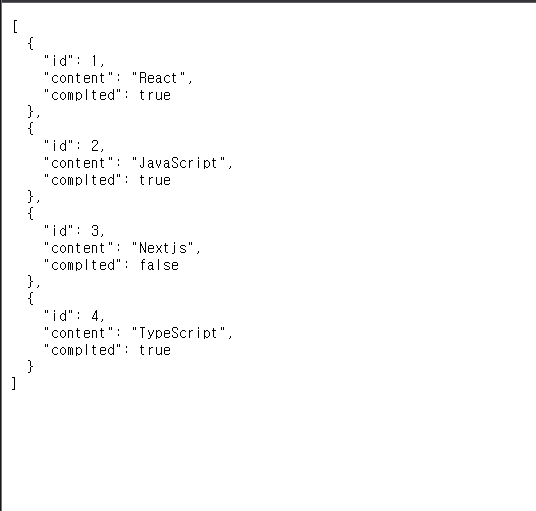
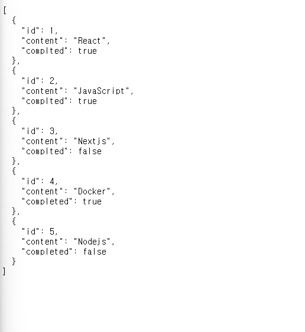
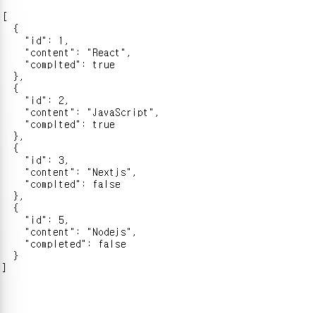

# 모던 자바스크립트 44장 : REST API

## 개요

**REST(Representationoal State Transfer)**

- `REST`의 기본 원칙을 지킨 서비스 디자인 ➡️ `RESTful`
- `REST`는 `HTTP`를 기반으로 클라언트가 서버의 리소스해 접근하는 방식을 규정한 아키텍처
- `REST API`는 `REST` 기반으로 서비스 `API`를 구현한것을 의미

## REST API의 구성

**RESTAPI는 자원,행위,표현 3가지 요소로 구성**

- REST는 자체 표현 구조로 구성되어 REST API만으로 HTTP 요청의 내용을 이해할 수 있다

| 구성요소 | 내용                             | 표현 방법        |
| -------- | -------------------------------- | ---------------- |
| 자원     | 자원                             | URL(엔드포인트)  |
| 행위     | 자원에 대한 행위                 | HTTP 요청 메소드 |
| 표현     | 자원에 대한 행위의 구체적인 내용 | 페이로드         |

## REST API 설계 원칙

**REST에서 가장 중요한 기본적인 원칙은 두가지**

1. URL는 리소스를 표현하는데 집중
2. 행위에 대해 정의는 HTTP 요청 메서드를 통해 하는 것

**URL은 리소스를 표현해야한다**

- 리소스를 식별할 수 있는 이름은 동사보다는 명사를 사용
- 따라서 이름에 get같은 행위에 대한 표현이 들어가서는 안된다

```tsx
# bad
GET/getTodos/1
GET/todos/show/1

# good
GET/todos/1
```

**리소스에 대한 행위는 HTTP 요청 메서드로 표현**

- HTTP 요청 메서드는 클라이언트가 서버에게 요청의 종류와 목적을 알리는 방법
- 주로 5가지 요청 메서드를 사용해 CRUD를 구현
  - GET, POST, PUT, PATCH, DELETE

## JSON Server를 통한 REST API 실습

### JSON-Sever install

```tsx
pnpm add -D json-server
```

### db.json 파일 생성

```json
{
  "todos": [
    {
      "id": 1,
      "content": "React",
      "complted": true
    },
    {
      "id": 2,
      "content": "JavaScript",
      "complted": true
    },
    {
      "id": 3,
      "content": "Nextjs",
      "complted": false
    },
    {
      "id": 4,
      "content": "TypeScript",
      "complted": true
    }
  ]
}
```

### JSON Server 실행

```tsx
$ json-server --w db/db.json
```

### GET 요청

```jsx
/* JSON 서버 GET 요청 */

const END_POINT = "http://localhost:3000/todos";
const xhr = new XMLHttpRequest();
xhr.open("GET", END_POINT);
xhr.send();
xhr.onload = () => {
  if (xhr.status === 200) {
    document.querySelector("pre").textContent = xhr.response;
  } else {
    console.log("Error");
  }
};
```

<br />



<br />

### POST 요청

**todos 리소스에 새로운 todo 생성**

- `POST` 요청 시엔 `setRequestHeader` 메서드를 통해 요청 몸체에 담아 서버로 전송할 페이로드의 `MIME`타입을 지정해줘야 한다

```jsx
/* POST 요청 */
xhr.open("POST", END_POINT);
xhr.setRequestHeader("content-type", "application/json");
xhr.send(JSON.stringify({id: 5, content: "Nodejs", completed: false}));
xhr.onload = () => {
  if (xhr.status === 200) {
    document.querySelector("pre").textContent = xhr.response;
  } else {
    console.log("Error", xhr.statusText);
  }
};
```

### PUT 요청

**PUT 요청은 특정 리소스 전체를 교체할 때 사용**

- todos 리소스에 id로 todo를 특정 해 id를 제외한 리소스 전체를 교체
- PUT 요청시에는 setRequestHeader 메서드를 통해 요청 몸체에 담아 서버로 전송할 페이로드의 MIME 타입을 지정해야 한다

```jsx
/* PUT 요청 */
xhr.open("PUT", `${END_POINT}/4`);
xhr.setRequestHeader("content-type", "application/json");
xhr.send(JSON.stringify({id: 5, content: "Docker", completed: true}));
xhr.onload = () => {
  if (xhr.status === 200) {
    document.querySelector("pre").textContent = xhr.response;
  } else {
    console.log("Error", xhr.statusText);
  }
};
```

<br />



<br />

### PATCH 요청

**patch는 특정 리소스의 일부를 수정할 때 사용**

```jsx
/* PATCH 요청 */
xhr.open("PATCH", `${END_POINT}/4`);
xhr.setRequestHeader("content-type", "application/json");
xhr.setRequestHeader("Access-Control-Allow-Origin", "*");
xhr.send(JSON.stringify({complted: false}));
xhr.onload = () => {
  if (xhr.status === 200) {
    document.querySelector("pre").textContent = xhr.response;
  } else {
    console.log("Error", xhr.statusText);
  }
};
```

### DELETE 요청

**todos 리소스에 id를 사용해 todo를 삭제**

```jsx
/* DELETE 요청 */
xhr.open("DELETE", `${END_POINT}/4`);
xhr.send();
xhr.onload = () => {
  if (xhr.status === 200) {
    document.querySelector("pre").textContent = xhr.response;
  } else {
    console.log("Error", xhr.statusText);
  }
};
```

<br />



<br />
