# 모던 자바스크립트 45장 : Promise

## 개요

**자바스크립트는 비동기 처리를 위한 하나의 패턴으로 콜백함수를 사용**

- 그러나 전통적인 콜백 패턴은 콜백 지옥으로 인해 가독성이 나쁘고 비동기 처리 중 발생한 에러처리가 어려움
- 여러개의 비동기 처리를 하는데 또한 한계가 존재

**ES6 새로운 패턴 ➡️ 프로미스**

- 전통적인 콜배패턴이 가진 단점을 보완
- 비동기처리 시점을 명확하게 표현할 수 있게된다

## 비동기 처리를 위한 콜백패턴의 단점들

### 콜백 지옥(Callback Hell)

**`getData` 함수는 비동기함수이다.**

- 비동기 함수란?
  - 함수 내부에서 비동기적으로 동작하는 코드가 포함되어 있는 함수
  - 비동기 함수 호출 시 함수 내부의 비동기적으로 동작하는 코드가 완료되지 않았다 해도 기다리지 않고 즉시 종료
    - 즉, 비동기 함수 내부의 비동기로 동작하는 코드는 비동기 함수가 종료된 이후에 완료된다.
    - 따라서 비동기 함수 내부에서 비동기로 동작하는 코드에서 처리결과를 외부로 반환하거나 상위 스코프의 변수로 할당하게되면 기대한되로 동작하지 않는다 ❌

```js
/* 비동기 처리를 위한 콜백패턴의 단점들 */

/* 콜백 헬 */
const END_POINT = "https://jsonplaceholder.typicode.com/posts/1";
const getData = (url) => {
  const xhr = new XMLHttpRequest();
  xhr.open("GET", url);
  xhr.send();

  xhr.onload = () => {
    xhr.status === 200
      ? console.log(JSON.parse(xhr.response))
      : console.error(`${xhr.status} ${xhr.statusText}`);
  };
};

/* id가 1인 post 취득 */
getData(END_POINT);
```

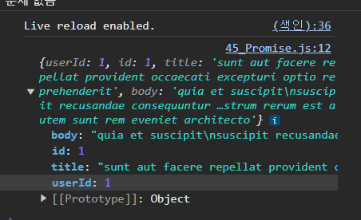

**setTimeout 함수는 비동기 함수이다**

- `setTimeout` 함수가 비동기 함수인 이유는?
  - 콜백함수의 호출이 비동기로 동작하기 때문
  - `setTimeout` 함수의 콜백함수는 `setTimeout` 함수가 종료된 이후에 호출
  - 따라서 `setTimeout` 함수 내부의 콜백함수에서 처리결과를 외부로 반환하거나 상위 스코프의 변수에 할당하면 기대한 대로 동작 ❌

**setTimeout 함수의 콜백함수에 상위 스코프에 변수 값 할당해보기**

- `setTimeout` 함수는 생성된 타이머를 식별할 수 있는 고유한 타이머 `id`를 반환하므로 콜백함수 내에서 값을 반환하는 것은 무의미

```js
/* setTimeout 함수의 콜백함수에 상위 스코프에 변수 값 할당해보기 */
let global = 0;
setTimeout(() => {
  global = 100;
}, 0);
console.log(global); // 0
```

**이러한 맥락에서 getData 함수도 동일하다**

- `getData` 함수가 비동기 함수인 이유는?
  - `getData` 함수 내부 `onload` 이벤트 핸들러가 비동기로 동작하기 때문
- `getData`함수 호출 시 `GET` ➡️ `onload` 이벤트 핸들러로 등록 ➡️ `undeinfed`를 반환하고 즉시 종료
  - 따라서 `getData` 함수의 `onload`이벤트 핸들러에서 서버의 응답결과를 반환하거나 상위 스코프에 변수를 할당해도 기대한 대로 동작하지 ❌
- `xhr.onload`의 이벤트 핸들러 프로퍼티에 바인딩한 이벤트 핸들러의 반환문은 `getData`함수의 반환문이 아니다
  - 따라서 `onload` 이벤트 핸들러의 반환값은 현재 캐치할 수 없게된다.

```js
const END_POINT = "https://jsonplaceholder.typicode.com/posts/1";
const getData = (url) => {
  const xhr = new XMLHttpRequest();
  xhr.open("GET", url);
  xhr.send();

  xhr.onload = () => {
    xhr.status === 200
      ? console.log(JSON.parse(xhr.response))
      : console.error(`${xhr.status} ${xhr.statusText}`);
  };
};
/* id가 1인 post 취득 */
const response = getData(END_POINT);
console.log(response); // undefined
```

**서버의 응답을 상위 스코프의 변수에 할당하면?**

- 이 또한 기대한대로 동작 ❌
- `xhr.onload` 이벤트 핸들러 프로퍼티에 바인딩 된 이벤트 핸들러는 언제나 맨 마지막에 `console.log`가 종료된 시점에 호출
- 따라서 todos를 찾으려는 시점은 아직 전역변수 todos에 서버에 응답된 결과가 할당되기 이전이다.

```js
/* 서버의 응답을 상위 스코프에 변수에 할당하면? */

let todos;

const END_POINT = "https://jsonplaceholder.typicode.com/posts/1";
const getData = (url) => {
  const xhr = new XMLHttpRequest();
  xhr.open("GET", url);
  xhr.send();

  xhr.onload = () => {
    xhr.status === 200
      ? (todos = JSON.parse(xhr.response))
      : console.error(`${xhr.status} ${xhr.statusText}`);
  };
};

/* id가 1인 post 취득 */
getData(END_POINT);
console.log(todos); // undeinfed
```

**xhr.onload 이벤트 핸들러에서 섭의 응답을 상위 스코프의 변수에 할당되면 처리 순서가 보장되지 않는 이유**

- 비동기 함수 `getData`호출 시 함수 코드를 평가하는 과정에서 `getData` 함수의 실행컨텍스트가 생성되고 실행 컨텍스트 스택에 푸쉬
  - 이후 함수 코드 실행 평가 과정에서 `xhr.onload` 이벤트 핸들러 프로퍼티에 이벤트 핸들러가 바인딩
- getData 함수 종료시 `getData` 함수의 실행 컨텍스트가 콜스택에서팝
- 곧바로 `conosle.log`가 호출
  - 이때 `console.log`의 실행 컨텍스트가 생성되어 실행 컨텍스트 스택에 푸시
  - 만약 `console.log`가 호출 되기 직전에 `load` 이벤트가 발생하였더라도 `xhr.onload` 이벤트 핸들러 프로퍼티에 바인딩한 이벤트 핸들러는 결코 `console.log`보다 먼저 실행되지 않는다 ❌
- **서버로 부터 응답이 도작하면 xhr 객체에서load 이벤트가 발생**
  - 이때 `xhr.onload` 이벤트 핸들러가 즉시 실행되는 것이 아니다 ❌
  - `xhr.onload` 이벤트 핸들러는 `load` 이벤트 발생 시 일단 태스크 큐에 저장되어 대기하다가
    - 콜스택이 비게 되면 이벤트 루프에 의해 콜스택으로 푸쉬되어 실행
  - 이벤트 핸들러도 함수 이므로 이벤트 핸들러의 평가 ➡️ 이벤트 핸들러 실행 컨텍스트 생성 ➡️ 콜스택 푸쉬 ➡️ 이벤트 핸들러 실행의 과정을 거친다
    - 따라서 `xhr.onload` 이벤트 핸들러가 실행되는 시점에는 콜스택이 빈상태여야하므로 `console.log`는 이미 종료된 이후이다
    - 만약 `getData` 함수 이후 `console.log`가 100번 호출되었다 하더라도 `xhr.onload` 이벤트 핸틀러는 모든 `console.log`가 종료된 이후 실행된다
  - 즉, `xhr.onload` 이벤트 핸들러에 상위 스코프의 변수에 서버의 응답결과를 할당하기 이전에 `console.log`가 먼저 호출되 `undefined`가 출력된다

**이처럼 비동기 함수는 비동기 처리 결과를 외부에 반환 할 수 없다 ❌**

- 또한 상위 스코프의 변수에도 할당할 수 없다 ❌
  - 따라서 비동기 함수의 처리결과(응답)에 대한 후속 처리는 비동기 함수 내부에서 수행되어야 한다
  - 이때 콜백함수를 전달하는 것이 일반적
  - 필요에 따라 비동기 처리가 성공할 때 호출 된 콜백함수와 비동기 처리 실패시 호출될 콜백함수를 전달한다

```jsx
/* getData를 콜백패턴을 사용해 데이터 응답결과를 반환받을 수 있다 */
const END_POINT = "https://jsonplaceholder.typicode.com/posts/1";
const getData = (url, success, reject) => {
  const xhr = new XMLHttpRequest();
  xhr.open("GET", url);
  xhr.send();

  xhr.onload = () => {
    xhr.status === 200
      ? success(JSON.parse(xhr.response))
      : reject(`${xhr.status} ${xhr.statusText}`);
  };
};
/* id가 1인 post 취득 */
getData(END_POINT, console.log, console.error);

/**/
{userId: 1, id: 1, title: 'sunt aut facere repellat provident occaecati excepturi optio reprehenderit', body: 'quia et suscipit\nsuscipit recusandae consequuntur …strum rerum est autem sunt rem eveniet architecto'}
```

**콜백헬**

- 콜백함수를 통해 비동기 처리 결과에 대한 후속처리를 수행하는 비동기 함수가 비동기 처리 결과를 가지고 또 다시 비동기 함수를 호출해야 한다면
- 콜백함수 호출이 중첩되어 복잡도가 높아지는 현상 발생

```tsx
const END_POINT = "https://jsonplaceholder.typicode.com";
const getData = (url, success, reject) => {
  const xhr = new XMLHttpRequest();
  xhr.open("GET", url);
  xhr.send();

  xhr.onload = () => {
    xhr.status === 200
      ? success(JSON.parse(xhr.response))
      : reject(`${xhr.status} ${xhr.statusText}`);
  };
};

/* 콜백헬 */
getData(`${END_POINT}/posts/1`, ({userId}) => {
  console.log(userId);

  getData(`${END_POINT}/users/${userId}`, (userInfo) => {
    console.log(userInfo);
  });
});
```

**콜백 헬은 가독성을 나쁘게 하며 실수를 유발 시키는 원인이된다**

```tsx
/* 콜백 헬은 가독성을 나쁘게 하며 실수를 유발 시키는 원인이된다 */
get("/stp1", (a) => {
  get(`/step2/${a}`, (b) => {
    get(`/step/3/${b}`, (c) => {
      get(`/step/4/${c}`, (d) => {
        console.log(d);
      });
    });
  });
});
```

### 에러처리의 한계

**비동기 처리를 위한 콜백 패턴의 문제점 두번째**

- 에러처리가 곤란하다
- `try` 코드 블록 내부 호출된 `setTimeout` 함수는 1초 뒤 콜백함수가 실행되도록 타이머를 설정한다.
  - 이후 비동기 함수 `setTimeout` 함수 호출 시 `setTimeout` 함수의 실행컨텍스트가 생성되 콜스택에 푸쉬된다
  - 이후 타이머 만료 시 `setTimeout` 함수의 콜백함수는 태스크 큐에 푸쉬된다
  - 콜스택이 비워졌을 때 이벤트 루프에 의해 콜스택으로 푸쉬되어 실행
- `setTimeout` 함수의 콜백함수 실행 시 `setTimeout` 함수는 이미 콜스택에서 제거된 상태
  - 이것은 `setTimeout` 함수의 콜백함수를 호출한것이 `setTimeout` 함수가 아니라는것이라는 의미이다
  - `setTimeout` 함수의 콜백 함수의 호출자가 `setTimeout`함수라면 콜스택의 현재 실행 중인 실행 컨텍스트가 콜백함수의 실행컨텍스트 일때, 현재 실행중인 실행 컨텍스트의 하위 실행컨텍스트가 `setTimeout` 함수이어야 한다
- 에러는 호출자 방향으로 전파된다
  - 콜스택의 아래 방향으로 전파됨
  - 하지만 `setTimeout` 함수의 콜백함수를 호출한 것은 `setTimeout`함수가 아니다 ❌
    - 따라서 함수의 콜백함수가 발생시킨 에러는 `catch` 블록에서 캐치할 수 없다 ❌
- 이러한 콜백헬이나 에러처리의 문제점을 해결하기 위해 `ES6`에는 `Promise`라는 표준 빌트인 객체가 도입

```jsx
/* 콜백패턴에서 에러 처리의 한계점 */
try {
  setTimeout(() => {
    throw new Error("Error");
  }, 1000);
} catch (error) {
  console.log("캐치한 에러", error);
}
```

## 프로미스의 생성

**Promise 객체 생성방법**

- `Promise` 생성자 함수를 `new` 연산자와 호출
- ECMAScript 사양에 정의된 표준 빌트인 객체이다
- `Promise` 생성자 함수는 비동기 처리를 수행할 콜백함수를 인수로 전달받는다
  - 해당 콜백함수는 `resolve`와 `reject`함수를 인수로 전달받는다

```jsx
/* 프로미스 */

/* 프로미스 생성 */
const promise = new Promise((resolve, reject) => {
    if (/* 비동기 처리 성공했을때 수행될 resolve 함수 */) {
        resolve('비동기 처리 성공')
    } else {
        reject('비동기 처리 실패')
    }
})
```

**Promise객체를 통한 getData 리팩토링**

- 비동기 함수 `promiseGetData`는 함수 내부에서 프로미스를 생성하고 반환된다
- 비동기 처리는 `Promise` 생성자 함수가 인수로 전달받은 콜백함수 내부에서 수행
  - 만약 통신이 성공하면 처리결과를 `resolve` 함수에 인수로 전달하면서 호출
    - 통신이 실패하면 처리결과를 `reject` 함수에 인수로 전달하며 호출

```jsx
/* Promise객체를 통한 getData 리팩토링 */
const promiseGetData = (url) => {
  return new Promise((resolve, reject) => {
    const xhr = new XMLHttpRequest();
    xhr.open("GET", url);
    xhr.send();
    xhr.onload = () => {
      xhr.status === 200
        ? resolve(JSON.parse(xhr.response))
        : reject(new Error(xhr.status));
    };
  });
};

const promiseObject = promiseGetData(END_POINT);
console.log(promiseObject);
```

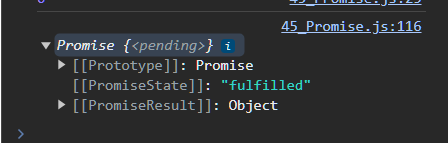

**프로미스는 현재 비동기 처리가 어떻게 진행되고 있는지를 나타나는 상태를 가진다**

| 프로미스 상태 정보 | 의미                                  | 상태 변경 조건                   |
| ------------------ | ------------------------------------- | -------------------------------- |
| pending            | 비동기 처리가 아직 수행되지 않은 상태 | 프로머스가 생성된 직후 기본 상태 |
| fulfiled           | 비동기 처리가 성공한 상태             | resolve 비동기 함수 호출         |
| rejected           | 비동기 처리가 실패한 상태             | reject 비동기 함수 호출          |

**프로미스의 상태는 resolve 또는 reject 함수를 호출하는 것으로 결정된다**

- `setteld` 상태
  - `fulfiled` 또는 `rejected` 상태
  - `pending`이 아닌 상태
  - 비동기 처리가 수행된 상태
- 프로미스는 `pending` 상태에서 `setteld` 상태로 변화한다
  - 하지만 일단 `settled` 상태가 되면 더는 다른 상태로 변화할 수 없다❌

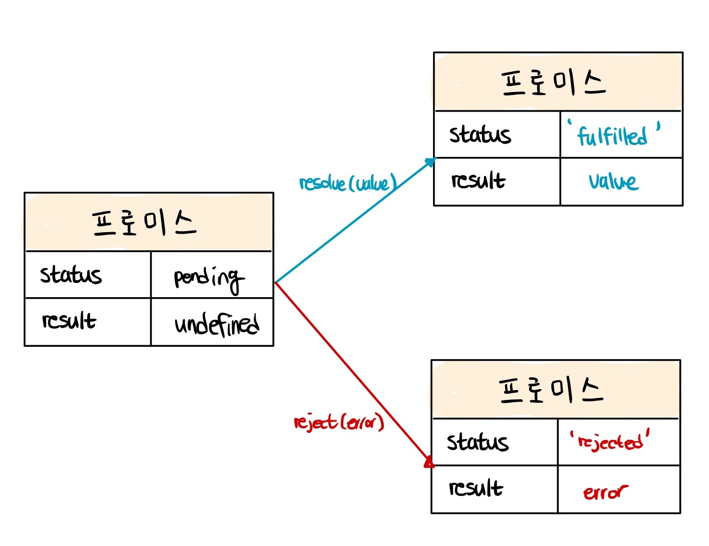

**프로미스는 비동기 처리 상태와 더불어 비동기 처리결과도 상태로 가진다**

- 비동기 처리 성공 시 프로미스는 `pending` 상태에서 `fulfilled` 상태로 변화
  - 그리고 비동기 처리 결과인 1을 값으로 가진다

```jsx
/* 프로미스는 비동기 처리 상태와 더불어 비동기 처리결과도 상태로 가진다 */
const fullfilled = new Promise((res) => res(1));
console.log(fullfilled);
```

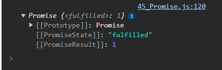

**비동기 처리 실패시 프로미스는 pending 상태에서rejected 상태로 변화**

- 비동기 처리 결과인 `Error` 객체를 값으로 가진다
- **프로미스는 비동기 처리상태와 처리결과를 관리하는 객체이다**

```jsx
const rejected = new Promise((_, reject) => reject(new Error("rejected")));
console.log(rejected);
```

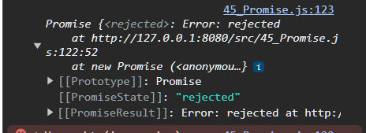

## 프로미스 후속 처리 메서드

**프로미스의 비동기 처리 상태가 변화되면 이에 따른 후속처리를 해야한다**

- 프로미스가 `fulfiled` 상태가 되면 프로미스의 처리결과를 가지고 무언가를 해야하고
- 프로미스가 `reject`가 되면 그에 따른 처리결과를 가지고 에러핸들링을 해야한다
  - 이를 위해 프로미스는 후속 메서드 `then`,`catch`,`finally`를 제공
- 프로미스의 비동기 처리 상태 변화시 후속 처리 메서드에 인수로 전달한 콜백함수가 선택적으로 호출
  - 이때 후속 처리 메서드의 콜백함수에 프로미스의 처리결과가 인수로 전달
- 모든 후속처리 메서드는 프로미스를 반환하며 비동기로 동작한다

### Promise.prototype.then

**then 메서드가 전달받는 인수**

- 첫번째 콜백함수 (resolve)
  - 프로미스가 `fulfilled` 상태가 되면 호출
  - 이때 콜백함수는 프로미스의 비동기 처리 결과를 인수로 전달받는다
- 두번째 콜백 함수 (reject)
  - 프로미스가 `reject` 상태가 되면 호출 됨
  - 이때 콜백함수는 프로미스의 비동기 처리 결과를 인수로 전달받는다

```tsx
/* then 메서드가 전달받는 인수 */
new Promise((resolve) => resolve("fullfilled")).then((v) => console.log(v)); // 'fullfilled'
new Promise((_, reject) => reject("Error")).then(
  "",
  (e) => console.log(e) // 'Error'
);
```

### Promise.prototype.catch

**catch 메서드**

- 한개의 콜백함수를 인수로 전달받는데
  - `catch` 메서드의 한개의 콜백함수는 `rejected` 상태인 경우에만 호출된다

```jsx
/* Promise.prototype.catch */
new Promise((_, reject) => reject(new Error("비동기 통신 실패!"))).catch((e) =>
  console.log(e)
); /* Promise.prototype.catch */
new Promise((_, reject) => reject(new Error("비동기 통신 실패!"))).catch((e) =>
  console.log(e)
);
```

<br />

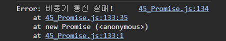

<br />

### Promise.prototype.finally

**finally 메서드**

- 프로미스의 성공,실패에 상관없이 무조건 적인 한번의 호출을 보장
- 프로미스의 상태에 상관없이 공통적으로 수행해야할 코드를 넣는다
- 해당 메서드도 언제나 프로미스 객체를 반환한다

```jsx
/* Promise.prototype.finally */

const finallyPromise = new Promise(() => {}).finally(() =>
  console.log("무적권 실행")
);

console.log(finallyPromise);
```

<br />

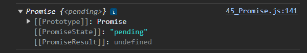

<br />

> 💡 **프로미스로 구현한 비동기 함수 getData를 사용해 후속처리 구현**

```jsx
/* 프로미스로 구현한 비동기 함수 getData를 사용해 후속처리 구현 */
promiseGetData(END_POINT)
  .then((res) => console.log(res))
  .catch((err) => console.error(err))
  .finally(() => {
    console.log("무조건 실행"); // '무조건 실행'
  });
```

<br />

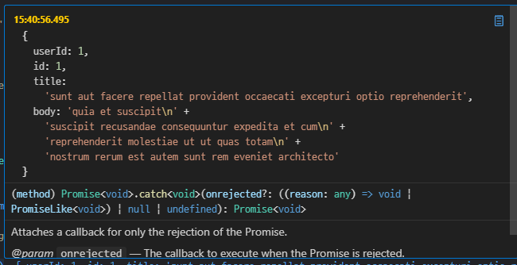

<br />

## 프로미스의 에러 처리

**프로미스는 에러를 문제없이 처리할 수 있게된다**

- 처리방법은 두가지 존재
  - `then` 메서드의 두번째 인수 콜백함수 `reject`를 호출해서 처리하는 방법
  - `catch` 메서드를 사용한 에러핸들링
- `catch`메서드를 통해 모든 `then`메서드를 호출한 이후에 호출하면 비동기 처리에서발생한 에러 뿐만아니라 `then`메서드 내부에서 발생한 에러까지 모두 캐치할 수 있게된다
- `then`메서드에 두번째 콜백 함수를 전달하는 방법(1)보다 `catch`메서드를 사용(2)하는 것이 가독성이 좋고 명확하다
- 따라서 에러처리에 대해선 `then`메서드 두번째 콜백함수를 사용하는것보다 `catch`메서드를 사용하는 것이 좋다

## 프로미스 체이닝

**콜백헬이 발생한 예제를 프로미스 체이닝을 통해 다시 구현**

- 아래 코드에선 `then` ➡️ `then` ➡️ `catch` 순서로 후속 처리 메서드를 호출
- `then`,`catch`,`finally`메서드는 언제나 프로미스 객체를 반환하므로 연속적으로 호출 가능
- 이를 프로머스 체이닝이라고 한다

```jsx
/* 콜백헬이 발생한 예제를 프로미스 체이닝을 통해 다시 구현 */
const BASE_URL = "https://jsonplaceholder.typicode.com";
promiseGetData(`${BASE_URL}/posts/1`)
  .then(({userId}) => promiseGetData(`${BASE_URL}/users/${userId}`))

  /* {id: 1, name: 'Leanne Graham', username: 'Bret', email: 'Sincere@april.biz', address: {…}, …} */
  .then((userInfo) => console.log(userInfo))
  .catch((erorr) => console.error(erorr));
```

**프로미스는 프로미스 체이닝을 통해 비동기 처리 결과를 전달받아 후속처리를 한다**

- 따라서 비동기 처리를 위한 콜백 페턴에서 발생하던 콜백 지옥이 발생하지 않는다 ❌
- 다만, 프로미스도 콜백 패턴을 사용하므로 콜백함수를 사용하지 않는것은 아니다
  - 콜백패턴은 가독성이 나쁨
  - 해당 문제는 ES8에서 도입된 `async/await`를 통해 해결 가능
  - `async/awiat`를 통해 프로미스의 후속 처리 메서드(`then,catch,finally`)없이 마치 동기처리와 같이 처리결과를 반환하도록 구현할 수 있다

**async/await를 통한 후속처리**

```jsx
(async () => {
  const {userId} = await promiseGetData(`${BASE_URL}/posts/1`);
  const userInfo = await promiseGetData(`${BASE_URL}/users/${userId}`);
  console.log(userInfo);
})();
```

## 프로미스의 정적 메서드

**Promise는 주로 생성자 함수로서 사용되지만 함수도 객체이므로 메서드를 가질 수 있다**

### Promise.resolve/Promise.reject

**이미 존재하는 값을 래핑해 프로미스를 생성하기 위해 사용**

```jsx
/* Promise.resolve / Promise.reject */
const resolvedPromise = Promise.resolve([1, 2, 3]);
resolvedPromise.then((res) => console.log(res)); // [1,2,3]

const rejectedPromise = Promise.reject(new Error("에러 객체"));
rejectedPromise.catch((error) => console.log(error)); // Error : 에러객체
```

### Promise.all

**Promise.all 메서드**

- 여러개의 비동기 처리를 모두 병렬처리할 때 사용
- 아래코드에선 세개의 비동기 처리를 순차적으로 처리
  - 앞선 비동기 처리 완료 시 다음 비동기 처리를 수행
  - 따라서 아래 코드는 첫번째 비동기처리에 3초, 두번째 비동기처리에 2초, 마지막 비동기 처리에 1초가 소요되어 총 6초가 소요된다
- 세개의 비동기 처리는 서로 의존하지 않고 개별적으로 수행되고 있음
  - 앞선 비동기 처리 결과를 다음 비동기 처리가 사용하지 않는다 ❌
  - 따라서 세개의 비동기 처리를 순차적으로 처리할 필요가 없다 ❌

```jsx
const requestData = () =>
  new Promise((resolve) => setTimeout(() => resolve(1), 3000));
const requestData2 = () =>
  new Promise((resolve) => setTimeout(() => resolve(2), 2000));
const requestData3 = () =>
  new Promise((resolve) => setTimeout(() => resolve(3), 1000));

const result = [];
requestData()
  .then((data) => {
    result.push(data);
    return requestData2();
  })
  .then((data) => {
    result.push(data);
    return requestData3();
  })
  .then((data) => {
    result.push(data);
    console.log(result);
  });
```

**Promise.all을 사용한 병렬처리**

```jsx
/* Promise.all을 사용한 병렬처리 */
const all = Promise.all([requestData(), requestData2(), requestData3()]).then(
  console.log
);

// [1,2,3] -> 약 3초 소요됨
console.log(all);
```

**Promise.all 메서드 필요인수는?**

- 프로미스를 요소로 가지는 배열 등의 이터러블
  - 전달받은 모든 프로미스가 모두 `fullfuiled` 상태가 되면 모든 처리 결과를 배열에 저장해 새로운 프로미스를 반환
- 위 코드에서 `Promise.all` 메서드의 각 요소는 다음과 같이 동작한다
  - 첫번째 프로미스 객체는 3초 후에 1을 `resolve`
  - 두번째 프로미스 객체는 2초후 2를 `resole`
  - 세번째 프로미스 객체는 1초후 3을 `resolve`
- 이때 첫번째 프로미스가 가장 나중에 fulfilled 상태가 되어도 `Promise.all` 메서드는 첫번째 프로미스가 `resolve`한 처리 결과부터 차례대로 배열에 저장한다
  - 즉, `Promise.all`을 통해 처리 순서를 보장받을 수 있다

**Promise.all 메서드는 인수로 전달받은 배열의 프로미스가 하나라도 rejected 상태가 될 시 나머지 프로미스가 fulfilled 상태가 되는 것을 기다리지 않고 즉시 종료한다**

```jsx
/* 하나라도 rejected 상태가 될 시 나머지 프로미스가 fulfilled 상태가 되는 것을 기다리지 않고 즉시 종료 */

Promise.all([
  new Promise((_, reject) =>
    setTimeout(() => reject(new Error("첫번째 에러")), 3000)
  ),
  new Promise((_, reject) =>
    setTimeout(() => reject(new Error("두번째 에러")), 2000)
  ),
  /* 3번째 프로미스객체가 가장 먼저 에러가 발생(1초)하므로 catch메서드로 전달 후 종료 */
  new Promise((_, reject) =>
    setTimeout(() => reject(new Error("세번째 에러")), 1000)
  ),
]).catch((erorr) => console.error(erorr));
```

**깃허브 아이디로 깃허브 사용자 이름을 취득하는 3개의 비동기 처리를 모두 병렬로 처리하는 예제**

- `prmiseGetData`함수가 반환한 3개의 프로미스로 이루어진 배열을 인수로 전달받고 프로미스들이 모두 `fullfield`상태가 되면 처리결과를 배열에 저장해 새로운 프로미스를 반환
- 이때 `Prmise.all` 메서드가 반환한 프로미스는 세개의 사용자 객체로 이루어진 배열을 담고 있다
  - 해당 배열은 첫번째 `then`메서드에 인수로 전달된다

```tsx
const promiseGetData = (url) => {
  return new Promise((resolve, reject) => {
    const xhr = new XMLHttpRequest();
    xhr.open("GET", url);
    xhr.send();
    xhr.onload = () => {
      xhr.status === 200
        ? resolve(JSON.parse(xhr.response))
        : reject(new Error(xhr.status));
    };
  });
};

const githubIds = ["suwan98", "simseonbeom", "yamoo9"];

const response = Promise.all(
  githubIds.map((id) => promiseGetData(`https://api.github.com/users/${id}`))
).then((users) => users.map((user) => user));

console.log(response);
```

<br />

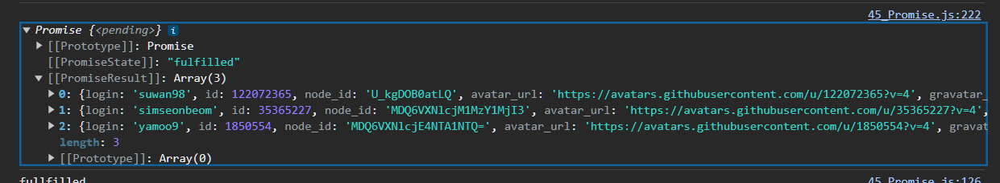

<br />

### Promise.race

**Promise.race**

- `Prmise.all`과 동일하게 프로미스를 요소로 가지는 배열등의 이터러블을 인수로 전달받는다
- 차이점은?
  - `Promise.all`과 달리 모든 프로미스가 `fufilled`상태가 되는것을 기다리지않고 가장 먼저 `fulfilled` 상태가 된 프로미스의 처리 결과를 `resolve`하는 프로미스를 반환한다
- reject인 경우는 동일
  - 전달된 프로미스가 하나라도 rejected 상태가 되면 에러를 reject하는 새로운 프로미스를 즉시 반환하게 된다

```jsx
Promise.race([
  new Promise((resolve) => setTimeout(() => resolve(1), 3000)),
  new Promise((resolve) => setTimeout(() => resolve(2), 2000)),
  new Promise((resolve) => setTimeout(() => resolve(3), 1000)),
]).then(console.log); // 3;
```

### Promise.allSettled

**Promise.allSettled**

- 전달받은 프로미스가 모두 `settled` 상태(성공 또는 실패)가 되면 처리 결과를 배열로 반환

```jsx
Promise.allSettled([
  new Promise((resolve) => setTimeout(() => resolve(1), 2000)),
  new Promise((_, reject) => setTimeout(() => reject(new Error("엘어")), 1000)),
]).then(console.log);
```

## 마이크로태스크 큐

**아래코드에선 어떤 순서로 로그가 출력될까?**

- 프로미스의 후속 처리 메서드 또한 비동기로 동작하므로 1➡️ 2➡️ 3의 순으로 동작할것같다
  - 그러나 ❌
  - 2 ➡️ 3 ➡️ 1 순으로 출력
- 그 이유는 뭘까?
  - 프로미스의 후속처리 메서드의 콜백함수는 태스크큐가 아닌 마이크로태스크 큐에 저장되므로
- 마이크로 태스크큐는 태스크 큐와의 별도의 큐
  - 해당 큐에는 프로미스의 후속처리 메서드의 콜백함수가 일시 저장
- 우선순위
  - 마이크로 태스크 큐 > 태스크큐
  - 이벤트루프는 콜스택이 비면 먼저 마이크로 태스크 큐에서 대기 중인 함수를 가져와 먼저 실행
  - 이후 마이크로태스크 큐가 비면 태스크 큐에서 대기하고 있는 함수를 가져와 실행

```jsx
setTimeout(() => console.log(1), 0);
Promise.resolve()
  .then(() => console.log(2))
  .then(() => console.log(3));
```

## fetch

**fetch란?**

- `fetch`함수는 `XMLHttpRequest` 객체와 마찬가지로 `HTTP` 요청 전송 기능을 제공하는 클라이언트 사이드 Web aPI

**필요로 하는 인수**

- URL
- HTTP 요청 메서드
- HTTP 요청 헤더
- 페이로드

```tsx
const promise = fetch(url, [,..options]
```

**fetch 함수는 HTTP 요청을 나타내는 Response 객체를 래핑한 Promise 객체를 반환**

```tsx
fetch(BASE_URL).then((response) => console.log(response));
```

<br />

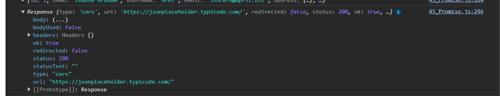

<br />

**fetch 함수 사용 시 에러 핸들링에 주의해야함**

- `fetch`함수가 반환하는 프로미스는 기본적으로 `404 Not Found`나 `500 Internal Serever Error`와 같은 HTTP 에러발생 시 에러를 `reject`하지 않는다
- 오프라인 등의 네트워크 장애 및 CORS 에러에 의해 요청이 완료되지 못한 경우에만 프로미스를 `reject`한다
- 따라서 `fetch`함수가 반환한 프로미스가 `resolve`한 불리언 타입의 ok 상태에 따라 명시적으로 에러를 핸들링 해야한다

```jsx
/* fetch 함수에서의 에러 핸들링 */

const wrongURL = "https://jsonplaceholder.typicode.com/XXX/1";
fetch(wrongURL)
  .then((response) => {
    if (!response.ok) throw new Error(response.statusText);
    return response.json();
  })
  .then((todo) => console.log(todo))
  .catch((err) => console.error(err));
```

## **fetch를 통한 HTTP 요청 메서드 지원**

**fetchRequest 객체 구성**

```jsx
const fetchRequest = {
  get(url) {
    return fetch(url);
  },
  post(url, payload) {
    return fetch(url, {
      method: "POST",
      headers: {"content-Type": "applicaiton/json"},
      body: JSON.stringify(payload),
    });
  },
  patch(url, payload) {
    return fetch(url, {
      method: "PATCH",
      headers: {"content-Type": "applicaiton/json"},
      body: JSON.stringify(payload),
    });
  },
  delete(url) {
    return fetch(url, {method: "DELETE"});
  },
};
```

### GET 요청

```jsx
const responseTodo = fetchRequest
  .get(END_POINT)
  .then((response) => {
    if (!response.ok) throw new Error("통신 실패");
    return response.json();
  })
  .then((res) => {
    console.log(res);
  });
```

<br />

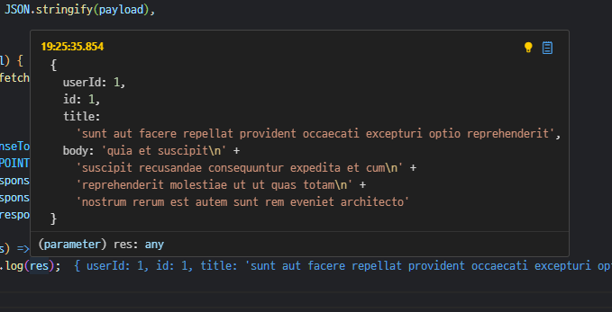

<br />
