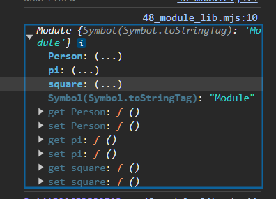

## 모듈의 일반적 의미

**모듈이란?**

- 애플리케이션을 구성하는 개별적 요소
- 재사용 가능한 코드조각을 의미
- 일반적인 모듈들은 기능을 기준으로 파일 단위로 분리
  - 이때 모듈이 성립하려면 모듈은 자신만의 독자적인 모듈스코프를 가질 수 있어야 한다

**모듈스코프**

- 모듈스코프는 기본적으로 비공개 상태이다
  - 즉, 자신만의 파일 스코프를 갖는 모듈의 모든 자산은 캡슐화되어 다른 모듈에서 접근할 수 없어야 한다
  - 모듈은 개별적 존재로서 애플리케이션과 분리되어야 한다

**하지만 애플리케이션과 완전히 분리되 개별적으로 존재하는 모듈은 재사용이 불가하므로 존재의미 ❌**

- 따라서 모듈은 공개가 필요한 자산에 한정해 명시적으로 선택적 공개가 가능하다
  - 이를 `export`라 한다
- 공개된 자산(`export`한 자산)은 다른 모듈에서 재사용할 수 있다
  - 이때 공개된 모듈의 자산을 사용하는 모듈을 모듈 사용자라 한다

**import**

- 모듈사용자는 모듈이 공개한 자산 중 일부 또는 전체를 선택해 자신의 스코프 내로 불러들여 사용할 수 있고 이를 `import`라고 한다

## 자바스크립트와 모듈

**자바스크립트는 태생적 한계로 제한적인 목적으로 생성됨**

- 따라서 기존에는 `import`,`export`와 같은 모듈이 지원 ❌
- 자바스크립트는 파일을 여러개 파일로 분리해 `script` 태그로 로드해도 분리된 자바스크립트 파일들은 결국 하나의 자바스크립트 파일 내에 있는것처럼 동작
  - 전역변수가 중복되는 등 문제 발생
  - 이 방법으로는 모듈화를 구현할 수 없다❌

**Commonjs와 AMD의 등장**

- 브라우저 환경에 국한되지 않고 범용적으로 사용하려는 움직임이 생기면서 모듈 시스템은 반드시 해결하는 핵심과제에서 등장
- 자바스크립트 런타임 환경인 `Node.js`는 모듈 시스템의 사실상 표준인 `CommnJS`를 채택
- `Node.js`는 `ECMAScript` 표준 사양은 아니지만 모듈 시스템을 지원
  - 따라서 `Node.js` 환경에서는 파일별로 독립적인 모듈스코프를 가질 수 있게된다

## ES6 모듈(ESM)

**ES6에는 클라이언트 사이드 자바스크립트에서도 동작하는 모듈 기능이 추가됨**

- 일반적인 자바스크립트 파일이 아닌 ESM 모듈임을 명확히 명시하기 위해 확장자명을 mjs를 사용할 것을 권장
- ESM에는 클래스와 마찬가지로 해당 파일내엔 자동적으로 `strict mode`가 적용

```tsx
<script type="module" src="app.mjs"></script>
```

### 모듈 스코프

**ESM은 독자적인 모듈 스코프를 가진다**

- HTML내의 `script`로 분리한 2개의 자바스크립트 파일은 하나의 자바스크립트 파일 내에 있는 것처럼 동작된다
  - 즉, 하나의 전역을 공유하고 있는 상태
  - 아래 코드에서 `x` 변수는 중복선언되며 의도치 않게 `x`의 값이 덮여씌워지게 된다

```tsx
📝 app.js

var x = 'foo'
console.log(window.x) // foo

📝 app2.js

var x = 'bar';

/* app.js에서 선언한 전역변수 x의 값이 재할당 */
console.log(window.x) // bar
```

**모듈 내 var 키워드로 선언한 변수는 더이상 전역변수가 아니며 window 객체의 프로퍼티 또한 아니다**

```jsx
/* 모듈 내 var 키워드로 선언한 전역변수 */
var x = "foo";
console.log(x);
console.log(window.x); // undeinfed
```

**모듈 내 선언한 식별자 또한 모듈 외부에서 참조 불가 ❌**

- 모듈 스코프가 다르므로

```tsx
📝 app.js

var x = 'foo'
console.log(window.x) // foo

📝 app2.js
console.log(x) // ReferenceError : x is not deinfed
```

### export 키워드

**모듈 내부에 선언한 모든 식별자는 기본적으로 해당 모듈 내부에서만 참조 가능**

- 모듈 내부에 선언한 식별자를 외부에 공개하여 다른 모듈이 사용하려면 `export` 키워드 사용

```jsx
/* export 키워드 */
/* 변수의 공개 */
export const pi = Math.PI;

/* 함수의 공개 */
export function square(x) {
  return x * x;
}

/* 클래스의 공개 */
export class Person {
  constructor(name) {
    this.name = name;
  }
}
```

**export 할 대상을 하나의 객체로 구성해 한번에 export 할 수도있다**

```jsx
/* export 할 대상을 하나의 객체로 구성해 한번에 export 할 수도있다 */
export {pi, square, Person};
```

### import 키워드

**import**

- 다른 모듈에서 `export` 한 식별자를 자신의 모듈 스코프 내부로 로드하려면 `import` 키워드 사용
- 아래 코드에서 `48_module_lib.mjs`는 애플리케이션의 진입점이므로 반드시 `script` 태그로 로드
  - 그러나 의존성인 `48_module.js`는 `script`태그로 로드 할 필요가 없다 ❌

```jsx
📝 48_module_lib.mjs

import {pi, square, Person} from "./48_module.js";

console.log(pi);
console.log(square);
console.log(Person);
```

**모듈이 export한 식별자 이름을 일일이 지정하지 않고 하나의 이름으로 한번에 import 하기**

- 이때 `import` 되는 식별자는 `as` 뒤에 지정한 이름의 객체에 프로퍼티로 할당

```jsx
/* 모듈이 export한 식별자 이름을 일일이 지정하지 않고 하나의 이름으로 한번에 import 하기 */
import * as lib from "./48_module.js";

console.log(lib);
console.log(lib.pi);
console.log(lib.Person);
console.log(lib.square);
```



**모듈이 export 한 식별자 이름을 as로 변경하고 import할 수도있다**

```jsx
import {pi as PI, square as SQ, Person as 사람} from "./48_module.js";

console.log(PI);
console.log(SQ);
console.log(사람);
```

### export default

**모듈 내 하나의 값만 export 시 default 키워드 사용**

- 기본적으로 이름 없이 하나의 값을 `export` 한다

```tsx
export default (x) => x * x;
```

**default 키워드 사용 시 var,let,const 키워드는 사용 불가하다 ❌**

```tsx
/* Syntax Error : Inexpected token 'const' */
export default const foo = () => {};
```

**default 키워드와 함께 export 한 모듈은 {} 없이 임의의 이름으로 import 한다**

- 보통은 해당 파일명으로 `import` 하는것이 일반적이다

```tsx
📝 lib.mjs

export default x => x * x;

📝 app.mjs
import lib from './lib.mjs'

console.log(lib(3)); 9
```
