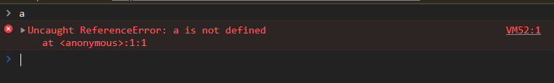

# 4장 : 변수란 무엇인가?

## 변수

**변수란?**

- 하나의 값을 저장하기 위해 확보한 메모리 공간 자체 또는 그 메모리 공간을 식별하기 위해 붙인 이름

### 변수에 여러개의 값을 저장하는 방법

**변수는 하나의 값을 저장하기 위한 메커니즘이다**

- 여러개의 값을 저장하려면 여러개의 변수를 사용해야 한다.
  - 단, 배열이나 객체같은 자료구조를 사용한다면 어려개의 값을 그룹화해 하나의 값 처럼 사용할 수 있다.

```jsx
var userId = 1;
var userName = "Lee";

//객체나 배열 같은 자료 구조를 사용하면 여러 개의 값을 하나로 그룹화해서 하나의 값처럼 사용할 수 있다
var user = {id: "1", name: "Lee"};
var users = [
  {
    id: 1,
    name: "Lee",
  },
  {
    id: 2,
    name: "Suwan",
  },
];
```

### `var result = 10 + 20`

- 메모리 공간에 저장된 값을 식별할 수 있는 고유한 이름 -> **변수이름(result)**
- 변수에 저장된 값 -> **변수 값(10 + 20)**
- 변수에 값을 저장하는 행위 -> **할당(=)**
- 변수에 저장된 값을 읽어들이는 행위 -> **참조(Reference)**

### 식별자

**식별자란?**

- 어떤값을 구별해서 식별할 수 있는 고유한 이름
- 값은 메모리 공간 안에 저장된다
  - 식별자는 메모리 공간에 저장되어 있는 어떠한 값을 구별해서 식별해 낼 수 있어야 한다

**식별자는 값이 아니라 메모리 주소를 기억하고 있다**

- 식별자로 값을 구별해 식별한다는것은 식별자가 기억하고 있는 메모리 주소를 통해 메모리공간에 저장된 값에 접근한다는 의미
- 즉 식별자는 **메모리 주소에 붙인 이름**

```js
result(변수이름(식별자)) -> 0x0669F913(메모리주소) 30(메모리)
```

### 변수 선언

**변수 선언 시 `var`,`let`,`const` 키워드를 사용해 변수를 선언한다**

- 만약 선언하지 않은 식별자에 접근하려 할 시, 참조에러가 발생한다
  - 해당 에러는 식별자를 통해 값을 참조하려고 했지만, 자바스크립트 엔진이 등록된 식별자를 참조할 수 없을 때 발생하는 에러이다



### 변수 선언의 실행시점과 변수 호이스팅

**아래코드에선 참조에러가 발생하지 않고 `undeinfed`가 출력된다 왜일까?**

- 변수 선언은 코드가 한줄 씩 순차적으로 실행되는 시점이다
  - 즉, 런타임이 아니라 그 이전단계에서 먼저 실행되기 때문에 `undeinfed`가 출력된다.
- 변수 선언(선언단계 + 초기화단계)의 소스코드가 순차적으로 실행되는 런타임 이전 단계에서 먼저 실행되었기 때문
- 이처럼 변수 선언문이 코드 선두로 **끌어올려진것 처럼 동작**하는 자바스크립트 고유의 특징을 **호이스팅**이라고 한다.
- 변수 선언문뿐만 아니라 `var`,`let`,`const`,`function`,`class` 예약어를 사용해 선언하는 모든 식별자는 호이스팅 된다.
  - 모든 선언문은 런타임 이전 단계에서 먼저 실행되기 때문에

```js
console.log(score); // undefined

var scroe; // 변수 선언문
```

### 값의 할당

**변수에 값을 할당할때는 할당연산자(`=`)를 사용한다**

- 우변의 값을 좌변의 변수에 할당

```js
var score; // 변수 선언
score = 90; // 값의 할당
```

- 변수의 선언과 값의 할당을 하나의 문으로 단축표현

```js
var score = 90; // 변수의 선언과 값의 할당을 동시에
```

> 💡 **이때 주의 할 점은 변수 선언과 값의 할당의 실행시점이 다르다는 것**

**변수선언**

- 소스코드가 순차적으로 실행되는 시점(런타임) 이전에 먼저 실행된다.

**값의 할당**

- 소스코드가 순차적으로 실행되는 시점(런타임)에 실행된다.

### 값의 재할당

**재할당이란?**

- 이미 값이 할당되어 있는 변수에 새로운 값을 다시 할당하는 것
- 만약 값을 재할당 할 수 없어 변수에 저장된 값을 변경할 수 없는 경우는?
  - 변수가 아니라 상수라한다.
  - 상수는 단 한번만 할당할 수 있는 변수이다.

```js
var score = 90; // 변수 선언과 값의 재할당
score = 83; // 값의 재할당
```
