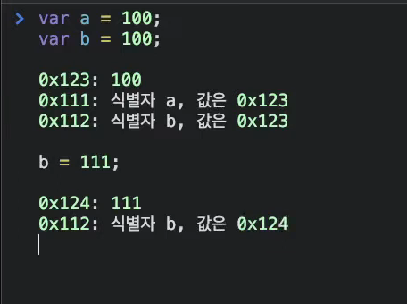

# 모던자바스크립트 6장 : 데이터타입

## 개요

**데이터타입이란?**

- 값의 종류를 뜻함
- 자바스크립트의 모든 값을 데이터타입을 가짐
- 자바스크립트(ES6)에선 총 7개의 데이터타입을 제공
- 7개의 데이터타입은 원시타입(primitive-type)/객체타입또는 참조타입(object/reference-type)으로 분류

| 구분      | 데이터타입        | 설명                                                |
| --------- | ----------------- | --------------------------------------------------- |
| 원시타입  | 숫자 타입         | 숫자, 정수와 실수 구분 없이 하나의 숫자 타입만 존재 |
|           | 문자열타입        | 문자열                                              |
|           | 불리언 타입       | 논리적 참과 거짓                                    |
|           | undefined 타입    | var로 선언된 변수에 암묵적으로 할당되는 값          |
|           | null 타입         | 값이 없다는 것을 의도적으로 명시할때 사용되는 값    |
|           | 심벌타입          | ES6에 추가된 새로운 타입                            |
| 객체 타입 | 객체,함수,배열 등 |                                                     |

## 숫자타입

**자바스크립트는 모든 수를 실수로 처리하며 정수만을 표현하기 위한 데이터타입이 별도로 존재 X**

```js
// 모두 숫자 타입
var int = 10; // 정수
var double = 10.12; // 실수
var nagative = -20; // 음의 정수
```

```js
var binadry = 0b01000001; // 2진수
var octal = 0o101; // 8진수
var hex = 0x41; // 16진수

//표기법만 다를 뿐 모두 같은 값
conosole.log(binadry); // 65
conosole.log(octal); // 65
conosole.log(hex); // 65
```

**JS에서 숫자타입은 정수만을 위한 타입이 없고 모든 수를 실수로 처리하기 때문에 정수로 표시된다**

- `-`를 부여해도 사실은 실수 라는것을 의미한다

```js
console.log(1 === 1.0); // true
```

**숫자타입은 추가적으로 세가지 특별한 값도 표현할 수 있다**

- `infinity` : 양의 무한대
- -`Infinity` : 음의무한대
- `NaN` : 산술 연산 불가 (낫어 넘버)

```js
console.log(10 / 0) // infinity
console.log(10 / -0) // -Infintiy
console.log(1 * "철수")) // NaN
```

## 원시타입

### 문자열 타입

**텍스트 데이터를 나타내는데 사용된다**

- 작은따옴표, 큰따옴표, 백틱으로 텍스트를 감싸서 표현한다.

```js
var string;
string = "문자열"; //작은 따옴표
string = "문자열"; // 큰 따옴표
string = `문자열`; // 백 틱
```

**만약 문자열을 따옴표로 감싸지 않으면 엔진은 키워드나 식별자 같은 토큰으로 인식한다**

```js
//따옴표로 감싸지 않은 hello를 식별자로 인식한다
var string = hello; // ReferenceError : hello is not defiend
```

<br />

> **템플릿 리터럴**

**멀티라인 문자열, 표현식 삽입, taged-template등 편리한 문자열 처리기능을 제공한다**

- 문자열을 백틱으로 감싼다

```js
var template = `Template`;
console.log(template); // Template
```

**템플릿 리터럴에서의 표현식 삽입**

```js
var first = "Suwan";
var last = "Go";

console.log(`My Name is ${first} ${last}`); // My Name is Suwan Go
```

### 불리언 타입

논리적 참,거짓을 나타내는 `true`와 `false`가 존재한다.

```js
var foo = true;
console.log(foo); // true

foo = !foo;
console.log(foo); //false
```

### undefined 타입

**`undefined`를 직역하면 ‘정의되지 않은’이다**

- `var`키워드로 선언한 변수는 암묵적으로 `undefined`로 초기화된다
  - 따라서 **변수를 선언한 이후 값을 할당하지 않는 변수를 참조하려면 `undefined`가 반환된다**

```js
var foo;
console.log(foo); // undefiend
```

### null 타입

**`null`타입의 값은 `null`이 유일하다**

- 프로그래밍에서 `null`은 변수에 값이 없다는것을 의도적으로 명시할 때 사용된다.
- 변수에 `null`을 할당한다는 것의 의미는?
  - 변수가 이전에 참조하던 값을 더이상 참조하지 않겠다는 의미

```js
var foo = "Lee";

//이전 참조를 제거, foo 변수는 더이상 'Lee'를 참조하지 않는다
foo = null;
```

### Symbol 타입

**변경 불가능한 원시 타입의 값**

- 심벌 값은 다른 값과 중복되지 않는 유일무이한 값이다.
  - 따라서 주로 이름이 충돌할 경우가 없어야할 객체의 유일한 프로퍼티 키를 만들기 위해 사용
- 심벌 이외의 원시값은 리터럴을 통해 생성하지만, 심벌은 `Symbol()`생성자 함수 호출을 통해 생성된다.
  - 이때 생성된 심벌값은 외부에 노출되지 않으며, 다른값과 절대 중복되지않는 유일무이한 값이 된다.

```js
var key = Symbol("key");
console.log(typeOf(key)); // symbol

var obj = {};
// 이름이 충돌할 위험이 없는 유일무이한 값인 심벌을 프로퍼티의 키로 사용한다
obj[key] = "value";
console.log(obj[key]); // value
```

<br />

## 참조타입(Reference Type)

### 객체 타입

**자바스크립트의 데이터타입은 크게 원시타입과 객체타입(=참조타입)으로 분류**

- 자바스크립트를 이루고 있는 거의 모든 것이 객체이다
- 6가지 데이터타입 이외의 값은 모두 객체타입이다
- 11장에 자세히 서술

## 데이터 타입의 필요성

**데이터 타입에 의한 메모리 공간의 확보와 참조**

- 값은 메모리에 저장하고 참조할 수 있어야 한다
- 메모리에 값을 저장하려면 먼저 확보해야 할 메모리 공간의 크기를 결정해야 한다



**컴퓨터가 데이터를 메모리공간에 저장하는 과정**

- 컴퓨터는 숫자 값 100을 저장하기 위해 메모리 공간을 확보
- 확보된 메모리에 숫자 값 100을 2진수로 저장
- 변수에 할당되는 값의 데이터 타입에 따라 확보해야할 메모리 공간의 크기가 결정된다.
- 자바스크립트 엔진은 리터럴 값인 100을 숫자타입의 값으로 파싱하고
- 숫자타입의 값 100을 저장하기 위해 8byte 분량의 메모리 공간을 확보한다
- 그리고 100을 2진수로 저장하게 된다

```js
var score = 100;
```

### 데이터 타입이 필요한 이유는?

- 값을 저장할 때 확보해야하는 메모리 공간의 크기를 결정할때 필요하다
- 값을 참조할때 한번에 읽어들여야 할 메모리 공간의 크기를 결정할 때 필요하다
- 메모리에서 읽어들인 2진수를 어떻게 파싱할지 걸졍해야 한다

## 동적 타이핑

### 동적타입 언어와 정적타입 언어

**정적타입 언어**

- `C++`
- `C`
- `Java`
- 변수를 선언할 때 변수에 할당할 수 있는 값의 타입을 런타임전에 선언해야한다
  - 이를 명시적 타입선언이라 정의함
- 정적타입언어는 변수의 타입을 변경할 수 없다
  - 따라서 변수에 선언한 타입에 맞는 값만 할당할 수 있다
- 컴파일 시점에 타입체크가 이루어지며, 타입체크를 통과하지 못했다면 에러를 발생시키고 프로그램의 실행자체가 막힌다

```c

/* c 변수에는 1바이트 정수 타입의 값만 할당할 수 있다*/
char c;

/* num 변수에는 4바이트 정수 타입의 값만 할당할 수 있다 */
int num;

```

**동적타입 언어**

- `JavaScript`는 동적타입언어이다.
  - 따라서 어떠한 데이터 타입의 값이라도 자유롭게 할당할 수 있다
- 자바스크립트의 변수는 선언이 아닌 할당에 의해 타입이 결정(=타입추론) 된다.
- 재할당에 의해 변수의 타입은 언제든 동적으로 변할 가능성이 존재
  - 이러한 특징을 **동적 타이핑**이라 부른다

### 동적 타입 언어와 변수

**자바스크립트는 개발자 의도와 상관없이 엔진에 의해 암묵적으로 타입이 자동 형변환 될 경우가 생김**

- 동적타입 언어는 유연성은 높지만 신뢰성은 떨어진다

**변수를 사용할 때 주의사항**

1. 변수는 꼭 필요한 경우에 한해 제한적으로 사용하기

- 변수 값은 재할당에 의해 언제든지 변할 수 있다.
- 변수의 무분별한 남발은 자제하고, 필요한 만큼 최소한으로 유지하도록 주의해야한다.

2. 스코프를 최대한 좁게 만들어 변수의 부작용을 억제

- 변수의 유효범위가 넓으면 넓어질 수록 변수로 인해 오류가 발생할 확률이 높아진다

3. 전역변수 최대한 사용 자제

- 어디서든지 참조하고 변경가능한 전역변수는 의도치 않게 값이 변경될 확률이 높고 다른 코드에 영향을 끼칠 가능성도 존재

4. 변수보다는 상수(`const`)를 사용해 값의 변경을 억제하기
5. 변수의 이름은 변수의 목적이나 이름을 잘 파악할 수 있도록 네이밍하기
