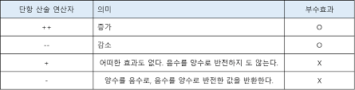
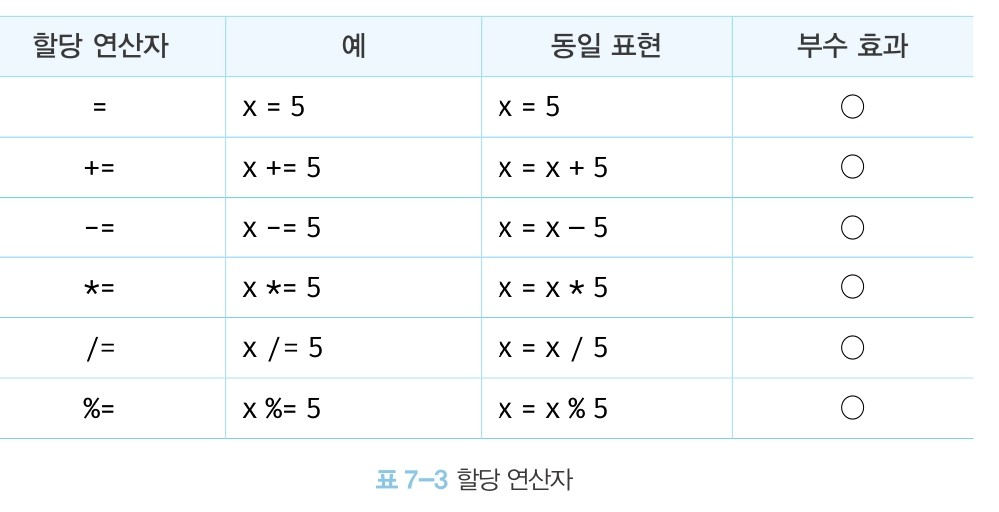
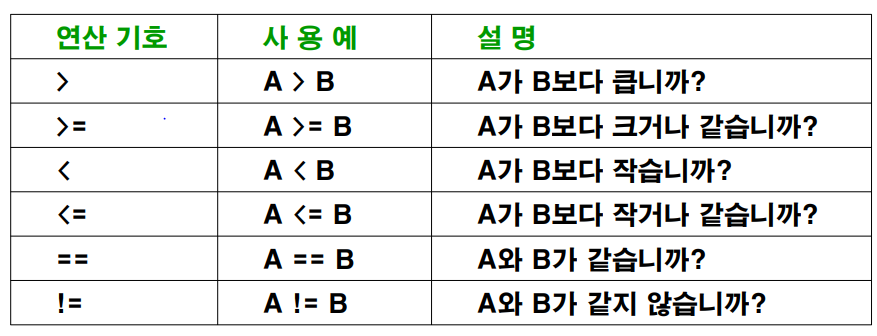
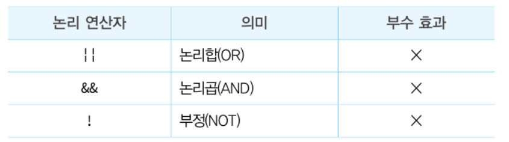

# 모던자바스크립트 7장 : 연산자

## 개요

**연산자란?**

- 연산자는 하나 이상의 표현식을 대상으로 산술,할당,비교,논리,타입,지수 연산등을 수행하는 하나의 값을 도출해낸다.

```js
5 * 4; // -> 산술연산자

"My name" + "suwan"; // -> 문자열 연결 연산자

color = "red"; // -> 할당 연산자

3 > 5; // -> 비교 연산자

true && false; // -> 논리 연산자

typeof "Hi"; // -> 타입 연산자
```

## 산술연산자

**피연산자를 대상으로 수학적 계산을 통해 새로운 값을 만드는 행위**

- 산술이 불가능한 경우 `NaN`이 반환된다.

### 이항 산술 연산자

**2개의 피연산자를 산술 연산해 숫자 값을 만든다**

- 어떤 산술 연산을 해도 피연산자의 값이 바뀌는 경우는 없고 언제나 새로운값을 만들 뿐

```js
/* 이항 산술 연산자의 예시*/

5 + 2;
5 - 2;
5 * 2;
5 / 2;
5 & 2;
```

### 단항 산술 연산자

**1개의 피연산자를 산술 연산하여 숫자값을 만든다**



<br />

```js
var x = 1;

/* ++연산자는 피연산자의 값을 변경하는 암묵적 할당이 이루어짐 */
x++; // x = x+1
console.log(x); // 2

/* --연산자는 피연산자의 값을 변경하는 암묵적 할당이 이루어짐 */
x--; // x = x -1
console.log(x); // 0
```

**증감 연산자는 위치에따라 값이 달라질 수도 있다**

- 피연산자 앞에 위치한 전위 증감연산자는 먼저 피연산자의 값을 증감시킨 후 다른 연산을 수행
- 피연산자 뒤에 위치한 후위 증감연산자는 먼저 다른 연산을 수행 한 후 피연산자의 값을 증감 시킨다.

```js
var x = 5,
  result;

/* 선할당 후 증가 */
result = x++;
conosole.log(result, x); // 5, 6

/* 선증가 후 할당 */
result = ++x;
console.log(result, x); // 7 7
```

### 문자열 연결 연산자

**`+`연산자는 피연산자 중 하나 이상이 문자열일 경우 문자열 연결연산자로 동작하게 된다**

```js
/* 문자열 연결 연산자 */
"1" + 2; // '12'
1 + "2"; // '12'

/* 산술 연산자 */
1 + 2; // 3

/* true는 1로 타입 변환된다 */
1 + true; // ->2

/* false는 0으로 타입 변환된다 */
1 + false; // -> 1

/* null은 0으로 타입 변환된다 */
1 + null; // -> 1

/* undefined는 숫자로 타입 변환 되지 않는다 */
1 + undeifned; // -> NaN
```

### 할당 연산자

**우항에 있는 피연산자의 평가 결과를 좌항에 있는 변수에 할당**



<br />

**할당문은 표현식인 문일까? 표현식이 아닌 문일까?**

- 할당문은 **값으로 평가되는 표현식인 문이다**

## 비교연산자

**비교연산자란?**

- 좌항과 우항의 피연산자를 비교한 후 결과를 `Boolean`으로 반환한다

### 동등/일치 비교 연산자

**값의 비교**

- 동등 비교연산자(`==`)은 느슨한 비교
- 일치 비교연산자(`===`)는 엄격한 비교를 한다

**동등비교(`==`) 연산자**

- **먼저** **암묵적 타입 변환**을 통해 **타입을 일치 시킨 후** ➡️ 같은 값인지 **비교**
  - 즉, 좌항과 우항의 타입이 다르더라도 암묵적 타입 변환 후 같은 값일 수 있다면 `true`를 반환한다.
- 동등비교 연산자는 예측하기 어려운 결과를 도출해 내므로 일치연산자를 사용하는 편이 좋다

```js
/* 동등비교 */
5 == 5; // -> true

/* 암묵적 타입 변환을 통해 타입을 일치시킨 후 비교 */
5 == "5"; // -> true
```

**일치비교(`===`)연산자**

- 좌항과 우항의 타입이 같고 값도 같은 경우에만 `true`를 반환한다

```js
/* 일치 비교 */
5 === 5; // -> true

/* 암묵적 타입 변환을 하지않고 값을 비교 */
5 === "5"; // -> false
```

### 대소 관계 비교 연산자

**피연산자의 크기를 비교해 `Boolean` 값을 반환한다**



<br />

### 삼항 조건 연산자

**조건식의 평가 결과에 따라 반환할 값을 결정하는 연산자**

`조건식 ? 조건식이 true 일때 반활할 값 : 조건식이 false 일때 반환할 값`

```js
var x = 2;

// 2 % 2는 0이고 0은 false로 암묵적 타입 변환
var res = x % 2 ? "홀수" : "짝수";

console.log(res); // 짝수
```

**삼항 조건 연산자 표현식은 값으로 평가 할 수 있는 표현식인 문이다**

- - 삼항 조건 연산자 표현식은 값처럼 사용 가능

```js
var x = 2;

// 삼항 조건 연산자 표현식은 표현식인 문이다. => 값처럼 사용 가능
var res = x % 2 ? "홀수" : "짝수";

console.log(res); // 짝수
```

### 논리 연산자

**우항과 좌항의 피연산자를 논리를 연산한다**



```js
//논리합(||) 연산자
true || true -> true
true || false -> true
false || true -> true
false || false -> false

//논리 곱(&&) 연산자
true && true -> true
true && false -> false
false && true -> false
false && false -> false

//논리 부정(!) 연산자
!true -> false
!false -> true
```

**논리 부정 연산자는 언제나 불리언 값으로 반환된다**

- 단 피연산자가 반드시 불리언 값일 필요는 없다
  - 즉 `falsy`한 값도 `OK`
- 피연산자가 불리언값이 아니면 불리언 타입으로 암묵적 타입이 변환된다

```jsx
!0 -> true
!'Hello' -> false
```

### 쉼표 연산자

**왼쪽 피연산자부터 차례대로 평가후 마지막 피연산자의 평가가 끝나면 마지막 피연산자의 평가 결과를 반환**

```jsx
var x, y, z;
(x = 1), (y = 2), (z = 3); //3
```

### 그 외의 연산자

| 연산자      | 개요                                                         |
| ----------- | ------------------------------------------------------------ |
| ?.          | 옵셔널 체이닝 연산자                                         |
| ??          | null 병합 연산자                                             |
| delete      | 프로퍼티 삭제                                                |
| new         | 생성자 함수를 호출 할 때 사용하여 인스턴스를 생성            |
| instaneceof | 좌변의 객체가 우변의 생성자 함수와 연결된 인스턴스 인지 판별 |
| in          | 프로퍼티 존재의 확인                                         |
