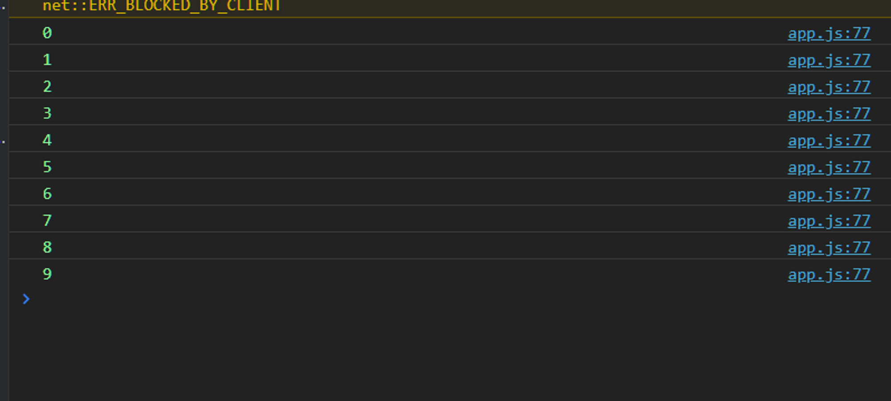
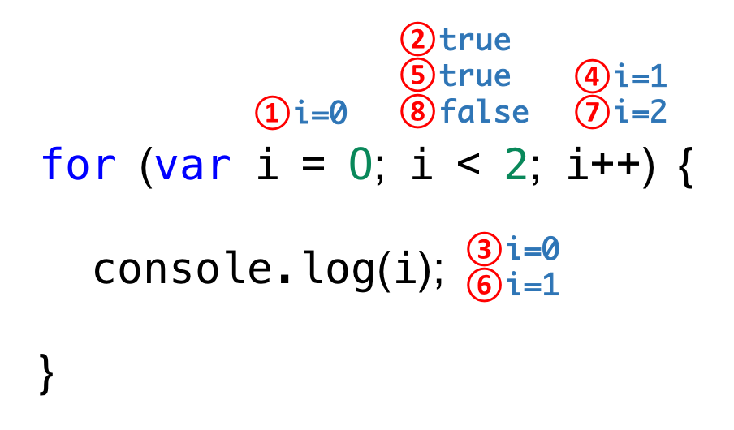

# 모던자바스크립트 DeepDive 8장 : 제어문

## 개요

**제어문을 왜 사용할까?**

- 조건에따라 코드 블록을 실행하거나 반복실행할 때 사용한다.

## 블록문

**블록이란?**

- 0개이상의 문을 중괄호로 묶은 것으로 코드 블록 또는 블록이라 정의
- 자바스크립트의 블록문은 하나의 실행단위로 취급
- 단독으로 사용할 수 있으나, 일반적으로 제어문이나 함수를 정의할 때 사용하는 것이 일반적이다

```js
/* 블록문 */
{
  var foo = 100;
}

/* 제어문 */
var x = 1;
if (x < 10) {
  x++;
}

/* 함수 선언문 */
function sum(a, b) {
  return a + b;
}
```

## 조건문

**조건문은 주어신 조건식의 평가 결과에 따라 코드블록의 실행을 결정한다**

- 조건식은 불리언 값으로 평가 될 수 있는 **표현식**
- 자바스크립트는 `if ..else`와 `switch 문`으로 **두가지 조건문**을 제공

### if…else 문

**주어신 조건식의 평과결과, 논리적 참 또는 거짓에 따라 실행할 코드 블록을 결정**

- `true` 일경우
  - `if` ➡️ 코드 블록 실행
- `false`일 경우
  - `else` ➡️ 코드 블록 실행

```jsx
if (조건식) {
  // 조건식이 참이면 코드 블록 실행
} else {
  // 조건식이 거짓일때 코드 블록 실행
}
```

**조건식을 추가한다면?**

- `else if`문 사용

```js
if(조건식 1) {
	//조건식이 참일때 실행
}else if(조건식 2){
	// 조건식2가 참일 때 실행
}else {
	// 조건식 1과 2가 모두 거짓일 때 실행
}
```

**if ..else문은 삼항연산자로 바꿔서도 사용 가능하다!**

```js
//x가 짝수이면 result 변수에 문자열 '짝수'를 할당 / 홀수이면 문자열 '홀수'를 할당
var x = 2;
var result;

if (x % 2) {
  // 2%2는 0이다 이때 0은 false로 암묵적으로 강제 형변환
  result = "홀수";
} else {
  result = "짝수";
}

console.log(result); //짝수
```

### switch 문

**주어신 표현식을 평가 후 그 값과 일치하는 표현식을 갖는 case 문으로 실행흐름을 옮긴다**

- 표현식과 일치하는 `case`문이 존재하지 않는다면 실행순서는 `default`문으로 이동
  - `default`는 옵션이다

```js
switch(표현식) {
	case 표현식1:
		switch 문의 표현식과 표현식 1이 일치하면 실행될 문;
		break;
	case 표현식2:
		switch 문의 표현식과 표현식2가 일치하면 실행될 문;
		break;
	default:
		switch 문의 표현식과 일치하는 case문이 없을때 실행될 문
	}
```

## 반복문

**조건식의 평가 결과가 참인 경우 코드 블록을 실행**

- 그 후 조건식을 다시 평가하여 여전히 참인 경우 코드블록을 다시 실행
- 이는 조건식이 거짓일때까지 반복된다

### for문

**조건식이 거짓으로 평가될때 까지 코드블록을 반복 실행**

```jsx
for (변수 선언문 또는 할당문; 조건식; 증감식;) {
	조건식이 참인 경우 반복 실행될 문
}
```

```js
for (let i =0 ; i<10 i++){
	console.log(i)
}
/* 여기서 i는 10보다 작을때까지 실행 */
/* 1,2,3,4,5,6,7,8,9... */
```

<br />



<br />

### for문의 실행 순서

1. for 문을 실행하면 가장 먼저 `var i = 0;` 이 실행된다

   선언문은 단 한번만 실행

2. 선언문의 실행이 종료되면 조건식이 실행 현재 `i`의 변수의 값은 0이므로 조건식의 평과결과는 `true`
3. 평가결가가 `true`이므로 코드 블록 실행

   `console.log(i);` ➡️ 여기선 `i = 0`으로 평가

4. 코드 블록 실행이 종료되면 증감식(`i++`)가 실행되어 변수 `i`의 값은 `1`이 됨
5. 증감식 실행이 종류 되면 다시 조건식이 실행되서 조건을 평가한다

   현재 `i`의 값은 1이므로 `i < 2`는 `true`

6. 결과가 `true`이므로 코드블록 실행 (`i=1`)
7. 증감식 `i++` 실행되어 `i` 변수의 값은 2가 됨
8. 증감식 실행이 종료되면 다시 조건식을 실행 ➡️ 현재 `i`가 2므로 조건식(`i<2`) 는 `false`가 되므로 `for문`의 실행이 종료



### While 문

**주어진 조건식의 평가 결과가 참이면 코드 블록을 반복 실행**

- `for문`은 반복횟수가 명확할 때 주로 사용 / `while문`은 반복횟수가 불명확할 대 주로 사용
- 조건문의 평과 결과가 거짓이 되면 코드블록을 실행하지 않고 종료
- 조건식의 평가 결과가 불리언 값이 아니면 불리언 값으로 강제 변환하여 참,거짓을 구별

```jsx
var count = 0;

// count가 3보다 작을 때 까지 코드 블록을 반복 실행
while (count < 3) {
  console.log(count); // 0,1,2
  count++;
}
```

**조건식의 평가 결과가 언제 참이면 무한루프가 된다**

```jsx
//무한루프
	while (true) {
			...
 }
```

무한루프에서 탈출하귀 위해서는 코드 블록내에 `if`문으로 탈출 조건을 만들고 `break` 문으로 코드 블록을 탈출

```jsx
var count++

//무한루프
while(true){
	console.log(count);
	count++
// count가 3이 되면 코드 블록을 탈출
if(count === 3) break;
}// 0 1 2
```

---

### do … while 문

**코드 블록을 먼저 실행 후 → 조건식을 평가**

- 따라서 코드 블록의 무조건 한번 이상의 실행을 **보장**
- 조건문의 결과와 상관없이 무조건 **do 블록의 코드가 적어도 1번은 실행**

```jsx
var count = 0;

// count가 3보다 작을 때까지 코드 블록을 반복 실행
do {
  console.log(count); // 0 1 2
  count++;
} while (count < 3);
```
