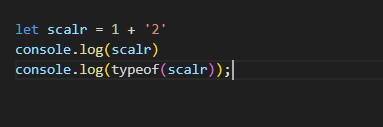
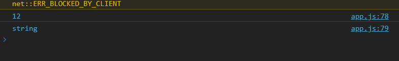
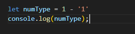
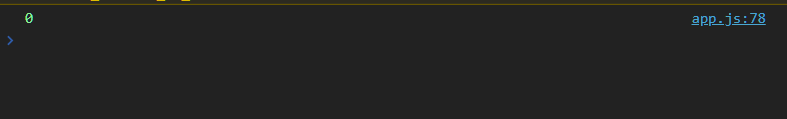

# 모던자바스크립트 DeepDive 9장 : 타입 변한과 단축 평가

## 타입변환이란?

**자바스크립트에서 모든 값은 타입이 존재한다**

- 값의 타입은 개발자의 의도에 따라 다른타입으로 변환할 수 있다
- 개발자가 의도적으로 값의 타입을 변환하는 것을 명시적 타입변환 또는 타입캐스팅이라고 한다

## 명시적 타입 변환

```js
var x = 10;

/* 명시적 타입변환 */
/* 숫자를 문자열로 명시적 타입변환 */
var str = x.toStirng();
console.log(typeof str, str); // string 10

/* x의 변수의 값이 변경은 ❌ */
console.log(typeof x, x); // number 10
```

## 암묵적 타입 변환

**표현식을 평가하는 도중에 자바스크립트 엔진에 의해 암묵적으로 타입이 자동 변환되는 경우**

- 이를 암묵적 타입 변환이라고 한다

```js
var x = 10;

/* 암묵적 타입 변환 */
/* 문자열 연결 연산자는 숫자 타입 x의 값을 바탕으로 새로운 문자열을 생성*/
var str = x + "";
console.log(typeof str, str); // string 10

/* x의 변수의 값이 변경은 ❌ */
console.log(typeof x, x); // number 10
```

### 문자열 타입으로의 암묵적 형변환

**`+`연산자는 피연산자 중 하나이상의 문자열이 포함되어있으면 문자열 연결 연산자로 동작한다**

- 자바스크립트 엔진에 의해 암묵적 타입변환으로 인해 `stinrg`으로 평가되었다




### 숫자 타입으로 암묵적 형변환

**`+`연결연산자가 아닌 그외 모든 산술 연산자 사용시**

- 모든 피연산자는 문맥상 모두 숫자타입어야한다
  - 따라서 자바스크립트 엔진은 피연산자를 모두 숫자형으로 암묵적 형변환한다




**비교 연산자는 불리언 값을 만들어 내야한다**

- 비교연산자는 피연산자의 크기를 비교하므로 모든 피연산자의 코드는 숫자타입 어야하 함
  - 따라서 숫자타입이 아닌 피연산자를 숫자타입으로 암묵적으로 타입 변환한 모습

```js
"1" > 0; // -> true
```

### 불리언 타입으로의 암묵적 형변환

**if 문이나 for 문과 같은 제어문 또는 삼항 조건 연산자의 조건식은 참이나 거짓으로 평가되어야 하는 표현식**

- 따라서 자바스크립트 엔진은 해당 평가 결과를 불리언 타입으로 암묵적 타입 변환

```js
if ("") console.log("1");
if (true) conosole.log("2");
if (0) console.log("3");
if ("str") console.log("4");
if (null) console.log("5");
```

**자바스크립트 엔진은 불리언 타입이 아닌 값을 Truthy/Falsy한 값이라 정의한다**

- 불리언 값으로 평가되어야 할 문맥에서 `Truty`값은 `true`로
- `Falsy` 값은 `false`로 암묵적 타입 변환 됨

<br />

> **`Falsy`한 값들은?**

- `false`
- `undefined`
- 0
- `null`
- `NaN`
- ‘’(빈 문자열)

## 명시적 타입 변환

생성자 함수(`String`, `Number`, `Boolean`)를 `new` 연산자 없이 호출하는 방법과 빌트인 메서드를 사용하거나 암묵적 타입 변환을 이용하는 방법등이 있다

### 문자열 타입으로의 변환

1. `String` 생성자 함수를 호출
2. `Object.prototype.toString` 메서드를 사용
3. 문자열 연결 연산자를 이용

```js
/* 1. String 생성자 함수를 호출해서 사용 */
String(1); // -> "1"
String(NaN); // -> "NaN"
String(Infinity); // -> "Infinity"

/* Boolean -> String */
String(true); // -> "true"
String(false); // -> "false"

/* 2. .toString을 사용해서 string으로 명시적 형변환 */
(1)
  .toString()(
    // -> "1"
    NaN
  )
  .toString()(
    // -> "NaN"

    // Boolean -> String
    true
  )
  .toString()(
    // -> "true"
    false
  )
  .toString(); // -> "false"

/* 3. 문자열 연결 연산자를 이용하는 방법 */
1 + ""; // => '1'
NaN + ""; // => 'NaN'
Infinity + ""; // => 'Infinity'

true + ""; // -> "true"
false + ""; // -> 'false'
```

## 단축평가

### 논리 연산자를 사용한 단축평가

**AND 연산자(`&&`)은 두개의 피연산자 모두 true로 평가 될 때 true를 반환**

- 첫번째 피연산자 `‘Cat’`은 `Truthy`한 값이므로 `true`로 평가
- 하지만 이시점까진 위 표현식을 평가할수 없다
- 두번째 피연산자까지 평가해보아야 위 표현식을 평가할 수 있다
- 즉 , **두번째 피연산자가 위 논리곱 연산자 표현식의 평가 결과를 결정**
  - 논리 연산의 **결과를 결정하는 두번째 연산자 즉, ‘Dog’를 그대로 반환**
- 논리 `AND` 연산자는 두 개의 피연산자가 모두 `true`로 평가될 때만 `true`를 반환하는 것이 아니라, 마지막으로 평가된 값을 그대로 반환

```js
"Cat" && "Dog"; // -> 'Dog'
```

**논리 OR 연산자(||)은 두 개의 피연산자 중 하나만 true로 평가되어도 true를 반환**

- 첫번째 `‘Cat`’은 `Truthy`한 값이므로 `true`로 평가
  - **즉 두번째 피연산까지 평가해보지 않아도 위 표현식을 평가할 수 있다**
    - 따라서 **논리연산의 결과를 결정한 첫번째 피연산자 문자열 ‘Cat’을 그대로 반환**

```jsx
"Cat" || "Dog"; // -> 'Cat'
```

**AND연산자와 OR연산자는 논리 연산의 결과를 결정하는 피연산자를 타입 변환(true나 false로) 변환하지 않고 그대로 반환한다**

- 이를 단축평가라 하고 단축평가는 표현식을 평가하는 도중에 평가 결과가 확정된 경우 나머지 평과과정을 생략하는 것을 뜻한다

**단축평가를 사용해서 if문 대체하기**

```js
const done = true;
const message = "";

//if문 사용
if (done) message = "완료";

// 단축평가 사용
message = done && "완료"; // done과 '완료' 모두 Truthy한 값이니 뒤에 있는 값인 '완료'가 할당됨
console.log(message); // -> '완료
```

**조건이 Falsy한 값일때 OR연산자 표현식으로 대체하기**

```js
const done = false;
const message = '';

//조건이 false일때 if문
if(!done) = '미완료' // done이 false일때 '미완료'를 할당

//단축평가로 대체해보기
message = done || '미완료' // done이 false이므로 message에 '미완료'가 할당된다
console.log(meesage) // '미완료'
```

## 단축평가의 활용

**객체는 키와 값으로 구성된 프로퍼티의 집합**

- 만약 객체를 가리킬때 기대하는 변수의 값이 객체가 아니라 `null`이나 `undefined`라면?
  - 객체의 프로퍼티 참조시 타입에러가 발생한다

```js
const elem = null;
const value = elem.value; // TypeError : Cannot read property 'value' of null
```

**단축 평가를 사용해서 에러를 방지**

**객체를 가리키기를 기대하는 변수가 `null` 또는 `undefined`가 아닌지 확인하고 프로퍼티를 참조할때**

- 해당 코드를 설명하면 `elem = null`
  - 즉 `falsy`한 값이다
- `elem && elem.value`는
- `elem` 이 `null` 즉 `falsy`한 값이기때문에
  - `elem ⇒ nul`l값이 출력

**여기서 elem이 null이 아닌 truthy한 값이면 elem.value가 출력된다**

```jsx
const elem = null;

/* elem 이 null 이나 undefined와 같은 Falsy 값이면 elem으로 평가 */
/* elem이 Truthy한 값이면 elem.value로 평가된다 */

const vlaue = elem && elem.value; //-> null
```

### 함수 매개변수에 기본값을 설정할 때

**수를 호출할때 인수를 전달하지 않으면 매개변수에서는 `undefined`가 할당**

- 단축평가를 사용해 매개변수의 기본값을 설정하면 `undefined`로 인해 발생할 수 있는 에러를 방지할 수 있다
- 근데 모던자바스크립트는 그냥 매개변수 기본값 설정으로 간단하게 쓰자

```js
/* 단축평가를 사용한 매개변수의 기본값 설정 */
function getStringLength(str) {
  str = str || "";
  return str.length;
}

getStringLength(); // -> 0
getStringLength("hi"); // -> 2 (hi의 length가 2기때문에)

/* ES6에서 매개변수의 기본값 설정 */
function getStringLength(str = "") {
  return str.length;
}

getStringLength(); // -> 0
getStringLength("hi"); // -> 2
```

## 옵셔널 체이닝

**옵셔널 체이닝이란?**

- 옵셔널 체이닝 연산자 `?.` 는 좌항의 피연산자가 `null` 또는 `undefined일` 경우 `undefined를` 반환하고 그렇지 않으면 우항의 프로퍼티 참조를 이어감

```js
const elem = null;

/* elem이 null 또는 undefined이면  undefined를 반환하고, 그렇지 않으면 우항의 프로퍼티 참조를 이어간다 */
const value = elem?.value;

/* 해당 value값이 null이기때문에 undefined를 반환 */
console.log(value); // --> undefined
```

**논리 연산자 `&&`은 좌항 피연산자가 `falsy`로 평가되는 값이면 좌항 피연산자를 그대로 반환한다**

- 하지만 옵셔널 체이닝 연산자 `?.`는 좌항 피연산자 `falsy`한 값이라도 `null` 또는 `undefined`가 아니면 우항의 프로퍼티 참조를 이어간다

```js
const srt = "";

/* 문자열의 길이를 참조 이때 좌항 피연산자 falsy값이라도 null 또는 undefined가 아니라면 우항의 프로퍼티 참조를 이어간다 */
const length = str?.length;
console.log(length); // -> 0
```

### null 병합 연산자 (nullish 병합 연산자)

**nullish 연산자란?**

- `null` 병합 연산자 **`??`**는 좌항의 피연산자가 `null` 또는 `undefined`일 경우 우항의 피연산자를 반환하고 그렇지 않으면 좌항의 피연산자를 반환

```jsx
/* 좌항의 피연산자가 null 또는 undefined라면 우항의 피연산자를 반환 */
/* 아니면 좌항의 피연산자를 반환 */
const foo = null ?? "default string";
console.log(foo); // 'default string'
```

**null 병합 연산자 ??는 좌항의 피연산자 Falsy한 값이라도 null 또는 undefined가 아니라면 좌항의 피연산자를 그대로 반환한다**

```jsx
/* 사용자가 설정하지 않았을 때 기본값을 사용하는 예제 */

/* 사용자가 입력한 이름을 가져옵니다. 입력이 없을 경우 null로 설정됩니다. */
const userInputName = null;

/* 사용자가 입력한 이름이 없을 때 기본값인 "Guest"를 사용합니다. */
const username = userInputName ?? "Guest";

console.log(username); // 출력: "Guest"
```
